# NEXUS Architecture

**NEXUS - AI Agent Runtime & Orchestration Platform**
*Connect. Orchestrate. Execute. Observe.*

This document describes the architecture as it exists after **Phase 6.8**. It is domain-agnostic:
nothing here assumes a particular business, industry, or deployment target. Components marked
**FUTURE** do not exist yet and are described only to show where current pieces are headed.

## Status

- **Phase 0 (complete):** correctness and hardening of a single-file LangGraph router - typed
  state, pinned model, bounded retries/timeouts, error handling, tests.
- **Phase 1 (complete):** durable thread-scoped state, a runtime execution model with
  request/thread identity, and structured observability.
- **Phase 2 (complete):** a deterministic tool/network security boundary - SSRF protection,
  URL/domain/scheme validation, response-size and redirect limits, tool authorization, a minimal
  thread-ownership boundary, and untrusted-content handling. Full detail in [SECURITY.md](SECURITY.md).
- **Phase 3 (complete):** a thin FastAPI service layer (`api.py`) over NexusRuntime
  - sessions, messages, runs, health/readiness - reusing Phase 1/2's execution model and access
  boundary unchanged. See [API layer (Phase 3)](#api-layer-phase-3) below.
- **Phase 4 (complete):** a deterministic evaluation framework (`evals/`) and a
  shared run/trace store (`run_store.py`) - routing/execution/tool/response/latency checks, token
  usage and configurable cost tracking, evaluation comparison, and a richer
  `GET /v1/runs/{request_id}`. See [Evaluation architecture (Phase 4)](#evaluation-architecture-phase-4)
  below.
- **Phase 5 (complete, this document):** production-oriented runtime foundations - bearer-token
  authentication (`auth.py`), authorization checked against the authenticated caller for
  sessions/runs/evaluations (`access.py`), a bounded per-principal rate limiter (`rate_limit.py`),
  SSE execution streaming, an optional PostgreSQL backend for durable, cross-process checkpoint and
  thread-ownership state, and DNS-rebinding-resistant `fetch` connections. See
  [Authentication (Phase 5)](#authentication-phase-5) through
  [Multi-instance analysis (Phase 5)](#multi-instance-analysis-phase-5) below.
- **Phase 6.1 (complete):** the first real slice of the NEXUS Console - a
  TypeScript/React frontend (`frontend/`) that is a pure client of the Phase 3 API: runtime status,
  Auto Route vs. direct-agent execution, a live SSE-driven execution trace, the real final
  response, and real run metadata. One small, justified backend addition (direct-agent execution
  graphs, CORS). See [NEXUS Console (Phase 6.1)](#nexus-console-phase-61) below.
- **Phase 6.2 (complete):** an Agent Registry (`agents.py`) making agents
  first-class, API-discoverable platform resources - `GET /v1/agents[/{agent_id}]`, now the
  authoritative allowlist for direct-agent execution - plus a Console Agents page, agent detail
  view, and a "Test Agent" flow that reuses the existing Playground rather than adding a second
  execution surface. See [NEXUS Console (Phase 6.2: Agent Registry)](#nexus-console-phase-62-agent-registry)
  below.
- **Phase 6.3 (complete):** completed executions as first-class observability
  objects - a new `GET /v1/runs` list endpoint (ownership-filtered, reusing the existing bounded
  `RunStore`) alongside the existing `GET /v1/runs/{request_id}` (now also returning the final
  `response` and which `agent` ran), and a Console Runs page + Run Detail view. The Run Detail
  trace reuses the exact same `ExecutionTrace`/`traceReducer.ts` the Playground's live SSE trace
  already uses - no second trace implementation. See
  [NEXUS Console (Phase 6.3: Runs + Run Detail)](#nexus-console-phase-63-runs--run-detail) below.
- **Phase 6.4 (complete, this document):** thread/session state as a first-class Console surface,
  explicitly distinct from a run - a new `GET /v1/sessions` list endpoint (discovered directly from
  LangGraph checkpoint state via the checkpointer's own `alist`, ownership-filtered the same way as
  Phase 6.3's run list) alongside an extended `GET /v1/sessions/{thread_id}` (now also returning
  full message history), and a Console Sessions page + Session Detail view. Cross-links Runs and
  Sessions (`GET /v1/runs?thread_id=`) without duplicating either. See
  [NEXUS Console (Phase 6.4: Sessions + State Explorer)](#nexus-console-phase-64-sessions--state-explorer)
  below.
- **Phase 6.5 (complete):** an authenticated, rate-limited, ownership-filtered `GET
  /v1/evaluations` endpoint for lightweight summaries, plus Console history, synchronous baseline
  execution through the existing endpoint, detail, actual case results, metrics, and comparison.
  The existing bounded process-local EvaluationStore remains the source of history. See
  [NEXUS Console (Phase 6.5: Evaluations)](#nexus-console-phase-65-evaluations) below.
- **Phase 6.6 (implemented; browser verification blocked by local renderer):** authenticated, rate-limited `GET /v1/tools` provides safe metadata
  derived from actual tool definitions and the existing agent-tool policy. `GET /v1/tools/activity`
  projects terminal tool events from retained, caller-owned runs. The read-only `/tools` page links
  tools to allowed agent details and activity to run details. Activity remains bounded and
  process-local, not a durable or system-wide audit history. See
  [NEXUS Console (Phase 6.6: Tools / Governance)](#nexus-console-phase-66-tools--governance).
- **Phase 6.7 (implemented):** ownership-filtered run comparison returns factual B-minus-A deltas.
  Eligible first-turn runs can be re-run through `NexusRuntime` in a new owned session. Original
  input is retained privately in the bounded process-local RunStore and omitted from public API
  models; runs with prior thread state are ineligible. This operation is not deterministic replay.
  See [NEXUS Console (Phase 6.7: Run Comparison + Re-run)](#nexus-console-phase-67-run-comparison--re-run).
- **Phase 6.8 (implemented):** a Dashboard combines bounded caller-owned summaries from existing
  APIs. `GET /v1/runs/summary` returns only run summary fields and omits traces, replies, tool details,
  and thread IDs. It reuses authentication, rate limiting, and ownership checks. No analytics service
  or new persistence was introduced. The sidebar adds an accessible compact layout at narrow widths.
  See [NEXUS Console (Phase 6.8: Dashboard + Console Polish)](#nexus-console-phase-68-dashboard--console-polish).
- **Phase 7 (implemented; not yet live-verified):** a backend Dockerfile (two-stage, non-root,
  environment-driven), a frontend Dockerfile (Vite production build served by nginx), a local
  Compose stack (PostgreSQL + API + Console) exercising the existing Phase 5 Postgres backend, and a
  GitHub Actions CI workflow (backend/frontend tests, a live-PostgreSQL integration job, a
  repository-hygiene job, and a container-build/Compose-smoke-test job). This development
  environment has neither Docker nor PostgreSQL installed, so the image builds, the Compose stack,
  and live PostgreSQL behavior were authored and statically reviewed but not executed or observed
  here - see [Production packaging (Phase 7)](#production-packaging-phase-7) below and README
  "Known limitations".
- **Not implemented:** broader metrics, RAG, advanced/semantic memory, human-in-the-loop, model routing,
  deterministic replay, OAuth/SSO/RBAC, a distributed rate limiter, TLS termination/reverse proxy/
  secrets-manager integration, a real cloud deployment target. See README
  "Known limitations" and "Recommended next steps".

This is a learning/interview project. It is **not production-ready** - a **production-oriented
foundation** - at the end of Phase 7. Browser verification for the latest Console surfaces remains
blocked by the local renderer environment; Phase 7's container/Compose/live-PostgreSQL behavior
remains blocked by this development environment lacking Docker/PostgreSQL (see below).

## Layered view

```
NEXUS Console                      - TypeScript/React (frontend/): Agent Playground + live
       |                             execution trace (Phase 6.1), an Agent Registry-backed
       |                             Agents page + Test Agent flow (Phase 6.2), a Runs +
       |                             Run Detail history view (Phase 6.3), a Sessions +
       |                             state explorer (Phase 6.4), Evaluations history/detail/
       |                             comparison (Phase 6.5), and read-only Tools/governance
       |                             (Phase 6.6). A pure HTTP/SSE client of
       |                             NEXUS API.
       |
Authentication                     - auth.py: Authorization header -> Principal (Phase 5)
       |
Authorization                      - access.py: is this principal allowed to touch this resource?
       |
Rate Limiting                      - rate_limit.py: bounded, per-principal, process-local (Phase 5)
       |
NEXUS API                          - FastAPI (api.py): sessions (list + detail, Phase 6.4),
       |                             messages, runs (list + detail, Phase 6.3), evaluations,
       |                             agents (Phase 6.2), tools + caller-owned tool activity
       |                             (Phase 6.6), health/readiness, + SSE stream (Phase 5)
       |
NEXUS Runtime                      - execution identity, checkpointer lifecycle, workflow observability
       |
LangGraph                          - the compiled state graph (nodes + edges + conditional routing)
       |
Classifier                         - single LLM call, structured output -> message category
       |
Router                             - pure Python, category -> route (no LLM call)
       |
Specialist Agents                   - counselor / logical / math / coding
       |
   ┌─────────┐
   │ Policy  │                    - tool_policy.py: tool authorization + URL/SSRF/domain/
   │ Layer   │                      redirect/size policy + DNS-rebinding pinning (Phase 5).
   └────┬────┘                      The model proposes; this decides.
        |
   Tool / MCP Layer                - the `fetch` tool (logical agent only), instrumented;
        |                            see "Why fetch is native, not MCP-mediated" below
        |
  External Systems                 - the live web (fetch's actual network calls, IP-pinned)
       |
Durable Checkpoint Store           - SQLite (dev default) OR PostgreSQL (Phase 5, cross-process-safe)
       |
Observability                      - structured JSON lifecycle events, correlated by request_id/
                                      thread_id; streamable live over SSE (Phase 5)
```

The model proposes an action ("call `fetch` with this URL"); the Policy Layer independently
decides whether it is allowed; only then does the Tool/MCP Layer execute it against an external
system. This ordering - propose, then validate, then execute - is not optional or
prompt-enforced; it is the only code path `main._instrument_tool` provides, so no tool call
reaches a real network address without passing through it first. See
[SECURITY.md](SECURITY.md) for the full rationale and test coverage.

**Authentication, authorization, and rate limiting (Phase 5) sit strictly above `NEXUS API` in this
diagram, not inside it or below it**: `api.py`'s `get_principal`/`enforce_rate_limit` dependencies
resolve and check every request *before* a route handler body runs, and `NexusRuntime` below never
sees an HTTP header or a credential - only the resulting plain `principal_id: str`, exactly as
`principal_id` already worked in Phase 2-4. See
[Authentication (Phase 5)](#authentication-phase-5) through
[Rate limiting (Phase 5)](#rate-limiting-phase-5) below.

**NEXUS Runtime has two independent callers**: the CLI (`main.py: run_chatbot`) and the API
(`api.py`). Neither reimplements execution - both call the exact same
`NexusRuntime.execute(thread_id, user_text) -> ExecutionResult` and
`NexusRuntime.get_state(thread_id) -> StateSnapshot`. The runtime itself has no knowledge of
either caller. As of Phase 6.1, the **NEXUS Console is a real third client of the API** (never of
the runtime directly, never of LangGraph) - see [API layer (Phase 3)](#api-layer-phase-3) and
[NEXUS Console (Phase 6.1)](#nexus-console-phase-61).

## Mermaid: component and data flow

```mermaid
flowchart TD
    subgraph consoleGroup["NEXUS Console (frontend/)"]
        DashboardUI["Dashboard (Phase 6.8): bounded runtime overview"]
        Console["Playground (Phase 6.1): mode selector,\ncomposer, live execution trace"]
        AgentsUI["Agents page + detail view (Phase 6.2):\nregistry cards, Test Agent"]
        RunsUI["Runs page + Run Detail (Phase 6.3):\nhistory table, reused trace"]
        SessionsUI["Sessions page + Session Detail\n(Phase 6.4): state table, message history"]
        EvalUI["Evaluations page + detail\n(Phase 6.5): history, metrics, comparison"]
        ToolsUI["Tools page (Phase 6.6): read-only registry, controls, retained activity"]
        RunCompareUI["Run comparison + guarded re-run\n(Phase 6.7)"]
    end

    subgraph futureConsole["FUTURE Console sections -- not built yet"]
        FutureSections["Broader metrics / final polish"]
    end

    CLI["CLI (main.py: run_chatbot)"]

    subgraph authchain["Auth chain (Phase 5, api.py dependencies)"]
        Auth["get_principal()\n(auth.authenticate)"]
        RateLimit["enforce_rate_limit()\n(rate_limit.RateLimiter)"]
    end

    subgraph fastapi["NEXUS API (api.py)"]
        Sessions["POST /v1/sessions\nGET /v1/sessions/{thread_id}\n(Phase 6.4: +message history)"]
        SessionsList["GET /v1/sessions\n(list, Phase 6.4: ownership-filtered,\ndiscovered via checkpointer.alist)"]
        Messages["POST /v1/sessions/{thread_id}/messages"]
        Stream["POST .../messages/stream\n(SSE, Phase 5)"]
        RunsList["GET /v1/runs and /v1/runs/summary\n(ownership-filtered full and lightweight views)"]
        RunDetail["GET /v1/runs/{request_id}\n(shared run_store.RunStore;\nPhase 6.3: +response, +agent)"]
        HealthReady["GET /health, GET /ready"]
        EvalEndpoints["POST /v1/evaluations\nGET /v1/evaluations (Phase 6.5 list)\nGET /v1/evaluations/{id}\nGET .../results, .../metrics\nGET .../compare/{a}/{b}"]
        AgentEndpoints["GET /v1/agents\nGET /v1/agents/{agent_id}\n(Phase 6.2)"]
        ToolEndpoints["GET /v1/tools\nGET /v1/tools/activity\n(Phase 6.6)"]
    end

    subgraph registry["Agent Registry (agents.py, Phase 6.2)"]
        AgentsModule["list_agents() / get_agent()\nis_executable()"]
    end

    subgraph evals["Evaluation framework (evals/)"]
        Dataset["EvaluationDataset\n(evals/datasets/baseline.json)"]
        Runner["run_evaluation() / run_case()\n(evals/evaluator.py)"]
        CaseEval["evaluate_case()\nrouting/execution/tools/response/latency\n(evals/cases.py)"]
        MetricsMod["summarize() / compare()\n(evals/metrics.py)"]
        EvalStore[("EvaluationStore\n(bounded in-process)")]
    end

    subgraph runtime["NEXUS Runtime (runtime.py)"]
        Execute["execute(thread_id, user_text)"]
        IDs["generate request_id\nread/reuse thread_id"]
        Obs["workflow_started / workflow_completed / workflow_failed"]
    end

    subgraph graph["LangGraph (main.py: graph_builder)"]
        Classifier["classifier\n(classifier_started/completed)"]
        Router["router\n(route_selected)"]
        Counselor["counselor agent"]
        Logical["logical agent\n(agent_started/completed)"]
        Math["math agent"]
        Coding["coding agent"]
    end

    subgraph policy["Policy Layer (tool_policy.py)"]
        Authz["check_tool_authorized\n(agent -> allowed tools)"]
        URLCheck["check_url\n(scheme/credentials/SSRF/domain)"]
    end

    Tool["fetch tool (native httpx)\ntool_started/completed/denied/failed"]
    External[("External web\n(HTTPS only, per-redirect-hop checked,\nIP-pinned connection -- Phase 5)")]

    Checkpointer[("SQLite OR PostgreSQL checkpointer\n(per-thread state, Phase 5 dual backend)")]
    AccessBoundary["ThreadAccessRegistry OR\nPostgresAccessStore (access.py)\nprincipal_id -> owned thread_ids"]
    RunStore[("run_store.RunStore\n(shared, bounded, in-process)")]

    Console -->|fetch + SSE, real| Auth
    Console -->|GET /health, polled| HealthReady
    AgentsUI -->|fetch, real| Auth
    AgentsUI -.->|"Test Agent" navigates to| Console
    RunsUI -->|fetch, real| Auth
    RunsUI -.->|"trace reuses"| Console
    SessionsUI -->|fetch, real| Auth
    EvalUI -->|fetch, real| Auth
    ToolsUI -->|fetch, real| Auth
    ToolsUI -.->|allowed agent| AgentsUI
    ToolsUI -.->|request_id| RunsUI
    SessionsUI -.->|"View Runs" navigates to, thread_id-filtered| RunsUI
    RunsUI -.->|"View Session" navigates to| SessionsUI
    Console -.->|"View Session" navigates to, once a turn completes| SessionsUI
    EvalEndpoints --> EvalStore
    ToolEndpoints --> RunStore
    EvalStore -. bounded summaries and results .-> EvalUI
    Auth --> RateLimit
    RateLimit --> Sessions
    RateLimit --> SessionsList
    RateLimit --> Messages
    RateLimit --> Stream
    RateLimit --> RunsList
    RateLimit --> RunDetail
    RateLimit --> EvalEndpoints
    RateLimit --> AgentEndpoints
    AgentEndpoints --> AgentsModule
    Messages -.->|"agent id validated via\nis_executable()"| AgentsModule
    Stream -.->|"agent id validated via\nis_executable()"| AgentsModule
    Sessions --> Execute
    SessionsList -.->|"checkpointer.alist(None) + owner_of(),\nnever claims, no second store"| Checkpointer
    SessionsList -.->|"owner_of(), read-only"| AccessBoundary
    Messages --> Execute
    Stream -->|observability.stream_events, live| Execute
    Stream -.->|build_run_record| RunStore
    Messages -.->|execute_and_record| RunStore
    RunStore -.->|records| RunDetail
    RunsList -.->|"list_recent() + owner_of()\nfilter, never claims"| RunStore
    RunsList -.->|"owner_of(), read-only"| AccessBoundary
    HealthReady -.->|cheap checkpointer probe, no LLM, no auth| Checkpointer
    EvalEndpoints --> Runner
    Dataset --> Runner
    Runner -->|execute_and_record, isolated eval-* thread| Execute
    Runner --> CaseEval
    CaseEval --> MetricsMod
    Runner -.->|records| RunStore
    Runner -.->|records, owner_principal_id set| EvalStore
    EvalEndpoints -.->|reads, ownership-checked| EvalStore
    MetricsMod -.->|feeds| EvalEndpoints
    CLI --> Execute
    Execute -->|checks principal_id, async| AccessBoundary
    Execute --> IDs --> Classifier
    Classifier --> Router
    Router -->|emotional| Counselor
    Router -->|logical| Logical
    Router -->|math| Math
    Router -->|coding| Coding
    Logical -->|proposes fetch call| Authz
    Authz -->|allowed| URLCheck
    Authz -.->|denied: tool_denied| Logical
    URLCheck -->|allowed| Tool
    URLCheck -.->|denied: tool_denied| Logical
    Tool -->|each redirect re-checked via URLCheck| External
    Counselor --> Execute
    Logical --> Execute
    Math --> Execute
    Coding --> Execute
    Execute --> Obs
    Execute <--> Checkpointer
```



## Execution identity

Every NEXUS execution carries two ids, both threaded through LangGraph's `config["configurable"]`
so every node can read them without generating anything itself:

- **`thread_id`** - identifies a conversation/session. Its LangGraph state (accumulated
  `messages`, last classification, last route) is durably persisted by the checkpointer under this
  id. The same `thread_id` reused later resumes exactly that state, including across a process
  restart. Different `thread_id`s never share state - this is enforced by the checkpointer's
  storage key, not by application logic that could be bypassed.
- **`request_id`** - identifies one `NexusRuntime.execute()` call (one user turn). Generated fresh
  by the runtime for every call (`runtime.new_request_id()`), never by a node. Every observability
  event emitted during that turn - across the classifier, router, whichever specialist ran, and
  any tool calls it made - carries this same `request_id`, which is what makes the logs for one
  turn correlatable end to end.

Concretely:

```python
config = {"configurable": {"thread_id": thread_id, "request_id": request_id}}
result_state = await graph.ainvoke({"messages": [...]}, config=config)
```

Nodes that need these ids for logging accept an optional second parameter,
`config: RunnableConfig | None = None`, and read `config["configurable"]`
(`main._context_from_config`). The default of `None` means every node function is still directly
callable without a runtime (this is how Phase 0's and Phase 1's unit tests invoke them), while
LangGraph automatically injects the real config when the node runs inside the compiled graph.

## Persisted state vs. runtime state vs. working context

Phase 1 introduces durable persistence without changing *how much* context any node sees - those
are two independent decisions, and conflating them was an explicit risk called out for this phase:

1. **Persisted state** - the full `messages` list for a thread (plus `message_type`/`route` from
   its most recent turn), stored by the LangGraph SQLite checkpointer (`AsyncSqliteSaver`). Survives
   process restarts. This is new in Phase 1.
2. **Runtime state** - the in-memory `State` dict LangGraph assembles for a single `execute()` call
   by merging the checkpointer's persisted values with the new input via the `add_messages` reducer.
3. **Working context** - what a given node actually sends to the LLM. As of Phase 1, this is still
   only the latest user turn (`main._latest_user_text`), exactly as in Phase 0.
4. **Future memory/context mechanisms** - summarization, retrieval, or a sliding window over
   `messages` - are **not implemented**. Persisting state does not, by itself, mean unlimited
   history gets sent to the model on every call; that remains a deliberate, separate decision.

See `main.py`'s `_latest_user_text` docstring and README "History semantics" for the same point in
the code and user-facing docs, respectively.

## Tool security boundary (Phase 2)

**The LLM is not a security boundary.** The model may propose a tool call; `tool_policy.py` is
what independently decides whether it happens, before any network I/O. Full rationale, every
control, and test coverage live in [SECURITY.md](SECURITY.md) - this section covers only how it
fits into the execution flow above.

Two gates, both inside `main._instrument_tool` (the one code path every tool call goes through,
so neither gate can be accidentally skipped):

1. **Tool authorization** - `tool_policy.check_tool_authorized(agent_name, tool_name)`, a static
   `{"logical": {"fetch"}}` mapping. Every other agent has no entry, so it's denied by default.
2. **Network/URL policy** - `tool_policy.check_url`, applied to the initial URL *and*, inside
   `secure_fetch`, to every redirect target before it's followed.

Either gate denying emits a `tool_denied` observability event (see below) with a stable reason
code and returns a safe result to the agent - never a raw exception.

**Why `fetch` is a native tool, not MCP-mediated (unlike Phase 0/1):** Phase 0/1 used the
third-party `mcp-server-fetch` MCP server to demonstrate tool integration through MCP. Its
internal HTTP client follows redirects automatically with no hook NEXUS can intercept, and
downloads the full response before NEXUS ever sees it - both inside an opaque subprocess. Neither
per-redirect policy enforcement nor a true streaming size cap (Phase 2 requirements) could be
implemented against that subprocess, only against its initial URL. So the `fetch` tool bound to
the logical agent is now NEXUS's own HTTP client (`tool_policy.secure_fetch`, built on `httpx`),
where every redirect hop and the response size are enforced under NEXUS's own control, under
test. This is a deliberate Phase 2 trade-off, not an accidental architecture drift - see
`main.py`'s fetch-tool section and [SECURITY.md §8](SECURITY.md#8-redirect-handling---implemented).

## Thread access boundary (Phase 2, reworked in Phase 5)

**`thread_id` is an identifier; ownership bookkeeping is not authentication.** `access.py`'s stores
are the abstraction that associate a principal with the threads it may touch: first-touch
ownership, checked inside `NexusRuntime.execute`/`get_state`/`new_session` - the one code path
everything uses. As of Phase 5, the `principal_id` this is checked against comes from a real
authenticated `auth.Principal` (see [Authentication (Phase 5)](#authentication-phase-5)) rather
than one hardcoded constant per caller type - see
[Authorization (Phase 5)](#authorization-phase-5) below for the full rework, and
[SECURITY.md §11](SECURITY.md#11-thread-access-model---minimal-not-authentication) for the
complete detail.

## Authentication (Phase 5)

`auth.py` resolves an HTTP `Authorization` header to a `Principal` at the API boundary - the
runtime and everything below it never see a header or a `Principal` object, only the resulting
plain `principal_id: str`:

```
HTTP request -> auth.authenticate(header, configured_token=config.api_token) -> Principal
             -> NexusRuntime.execute(..., principal_id=principal.principal_id)
```

Two modes, chosen entirely by whether `config.NexusConfig.api_token` (`NEXUS_API_TOKEN`) is set:

- **Token mode**: `Authorization: Bearer <token>` compared via `hmac.compare_digest` (constant-time).
  A valid token resolves to a stable, non-reversible `principal_id` (`"token-" + sha256(token)[:16]`)
  - the configured token is never logged, never echoed in an error, and cannot be recovered from
  the derived id.
- **Development mode** (no token configured): every request auto-authenticates as
  `access.LOCAL_API_PRINCIPAL` - exactly Phase 3/4's "no auth" behavior, kept as the default so
  nothing already built against the API breaks. `api.py`'s `lifespan` logs a `WARNING` every time
  this mode is active; `config.load_config()` refuses to start at all with
  `NEXUS_ENVIRONMENT=production` and no token - production is never silently unauthenticated.

`/health`, `/ready`, `/docs`, `/openapi.json` never require authentication. Full detail:
[SECURITY.md §16](SECURITY.md#16-authentication---implemented).

## Authorization (Phase 5)

Authorization ("is this authenticated principal allowed to touch this resource?") is checked for
every resource an API caller can reach, via `access.py`'s ownership stores (unchanged in kind from
Phase 2, now checked against a real principal):

- **Sessions/thread state**: `NexusRuntime.verify_access` - first-touch ownership.
- **Runs** (`GET /v1/runs/{request_id}`): checked via the run's own `thread_id` ownership - knowing
  a `request_id` string grants nothing by itself.
- **Evaluations**: `evals.models.EvaluationRun.owner_principal_id`, set by `api.py`'s
  `create_evaluation` to the triggering principal, checked on every read (summary, results,
  metrics, and both sides of a compare). A mismatch returns `404`, not `403` - deliberately
  indistinguishable from "doesn't exist," so a caller can't enumerate other principals' evaluation
  ids by observing which ones return 403 vs. 404.

`NexusRuntime.verify_access`/`new_session` are `async def` (changed from sync in Phase 3/4)
specifically so this works uniformly whether the backing store is the in-memory
`ThreadAccessRegistry` (a synchronous dict check) or the Phase 5 `PostgresAccessStore` (a genuine
database round trip) - `verify_access` adapts via `inspect.isawaitable()` rather than requiring
callers to know which store is active. Full detail: [SECURITY.md §17](SECURITY.md#17-authorization---implemented).

## Rate limiting (Phase 5)

`rate_limit.RateLimiter` is a bounded, in-process, fixed-window counter keyed by authenticated
`principal_id`, applied via `api.py`'s `enforce_rate_limit` dependency (which itself depends on
`get_principal`, so rate limiting always runs after - never instead of - authentication). Exceeding
`NEXUS_RATE_LIMIT_REQUESTS` within `NEXUS_RATE_LIMIT_WINDOW_SECONDS` returns `429 RATE_LIMITED`
with a `Retry-After` header. Bounded at `NEXUS_RATE_LIMIT_MAX_PRINCIPALS` tracked principals,
oldest-touched evicted first.

**Process-local, not distributed** - see [Multi-instance analysis (Phase 5)](#multi-instance-analysis-phase-5)
below. Full detail: [SECURITY.md §18](SECURITY.md#18-rate-limiting---implemented-process-local).

## SSE streaming architecture (Phase 5)

`POST /v1/sessions/{thread_id}/messages/stream` runs the identical `NexusRuntime.execute()` turn as
the synchronous endpoint, but forwards NEXUS's existing structured lifecycle events live instead of
returning one JSON body at the end:

```
Client
  |  POST .../messages/stream
  v
api.py: stream_message()  --(auth/authz/rate-limit, same chain as every endpoint)
  |
  |  request_id generated HERE, before execute() starts
  v
observability.stream_events(request_id)  --(new asyncio.Queue, live-filtered handler)
  |                                            |
  |  asyncio.create_task(                      | log_event() calls from classifier/router/
  |    runtime.execute(..., request_id=...)    | agents/tools push matching events onto
  |  )                                          | the queue AS THEY HAPPEN
  v                                            |
SSE generator: `while True: event = await queue.get(); yield event` <--------┘
  |  (breaks on workflow_completed / workflow_failed)
  v
run_store.build_run_record(result, collected_events, ...)  --(same shape as the sync endpoint)
  |
  v
yield one final "run_completed" event (carries the reply)
```

This reuses `observability.py`'s existing event vocabulary via a new sibling to
`capture_events()`: `stream_events(request_id)` attaches a `_StreamingHandler` that filters by
`request_id` **at emit time** (not after, the way `capture_events()`'s post-filter works) and
pushes matches onto an `asyncio.Queue` immediately - possible specifically because `request_id` is
now generated by the caller *before* `execute()` starts (see `NexusRuntime.execute`'s new optional
`request_id` parameter) rather than always being generated inside it.

`run_store.py` was refactored to extract `build_run_record()` (pure, given a result + event list)
out of `execute_and_record()` (which still owns capture-then-build for the synchronous path), so
the SSE endpoint - which must consume events live rather than all-at-once - builds the exact same
`RunRecord` shape without duplicating that logic. The streamed run is stored in the same
`run_store.RunStore` the synchronous endpoint uses, so `GET /v1/runs/{request_id}` works
identically either way.

**Lifecycle**: a client disconnecting mid-stream causes Starlette to close the async generator
(`GeneratorExit` at the current `await`), caught by a `finally` block that cancels the still-running
`execute()` task - nothing is left running in the background (verified: no task named
`nexus-sse-execute-*` remains in `asyncio.all_tasks()` shortly after a simulated disconnect). The
synchronous endpoint is entirely independent and unaffected by streaming's existence. Full detail:
[SECURITY.md §19](SECURITY.md#19-sse-security---implemented).

## Database backends: SQLite vs. PostgreSQL (Phase 5)

`runtime.create_runtime()` chooses between two checkpointer/ownership backends based on whether
`database_url` (or the `NEXUS_DATABASE_URL` env var) is set - no other code (agent logic, API
routes, evaluation framework) is aware of which one is active:

| | SQLite (default) | PostgreSQL |
|---|---|---|
| Checkpointer | `AsyncSqliteSaver` | `AsyncPostgresSaver` (`langgraph-checkpoint-postgres`, optional dependency) |
| Thread ownership | `access.ThreadAccessRegistry` (in-memory dict) | `access.PostgresAccessStore` (a `nexus_thread_owners(thread_id, principal_id, created_at)` table, claimed atomically via `INSERT ... ON CONFLICT DO NOTHING RETURNING`) |
| Cross-process safe? | No | Yes, for checkpoint state *and* thread ownership |
| Connection lifecycle | Opened/closed by `create_runtime`'s `async with` | The checkpointer and ownership store use separate pools, both opened/closed within `create_runtime`'s `async with` scope |

Both branches are lazy-imported (`langgraph.checkpoint.postgres.aio`, `psycopg_pool`) so importing
`runtime.py` never requires the optional `postgres` extra when Postgres isn't in use - the SQLite
path (the default, and everything the existing test suite exercises) has zero new dependencies.

**Verification**: the dispatch logic (does `create_runtime` actually attempt Postgres when
configured, rather than silently using SQLite?) is verified deterministically, without a real
database, in `tests/test_postgres_backend.py`. Full integration behavior (checkpoint persistence,
cross-thread isolation, restart persistence, ownership persistence across a simulated restart) is
also implemented in that same file but gated behind `NEXUS_TEST_DATABASE_URL` - skipped, not
faked, when no real PostgreSQL instance is available. See the Phase 5 report for what this
environment actually had available.

**Windows-specific caveat**: `psycopg`'s async mode requires a `SelectorEventLoop`; Windows'
default asyncio event loop is `ProactorEventLoop`. Running the Postgres backend on Windows requires
`asyncio.set_event_loop_policy(asyncio.WindowsSelectorEventLoopPolicy())` before the event loop
starts. This does not affect the SQLite path or Linux/macOS deployments.

## Multi-instance analysis (Phase 5)

An explicit audit of which components are safe across multiple NEXUS API processes sharing state,
and which remain process-local - PostgreSQL alone does **not** make the whole platform
multi-instance-safe:

| Component | Durable? | Safe across multiple processes? |
|---|---|---|
| LangGraph checkpoint state (SQLite) | Yes (survives restart) | **No** - one SQLite file, not designed for concurrent multi-process writers |
| LangGraph checkpoint state (PostgreSQL) | Yes | **Yes** - a real database server multiple processes can share |
| Thread ownership (`ThreadAccessRegistry`) | No (in-memory) | **No** - process-local dict |
| Thread ownership (`PostgresAccessStore`) | Yes | **Yes** - atomic `INSERT ... ON CONFLICT` against a shared table |
| `run_store.RunStore` (`GET /v1/runs/{request_id}`) | No | **No** - bounded in-process cache, by design (see README "Known limitations"); unaffected by which checkpointer backend is active |
| `evals.store.EvaluationStore` | No | **No** - same bounded in-process pattern as `RunStore` |
| `rate_limit.RateLimiter` | No | **No** - process-local counters; two instances enforce the configured limit independently, not as a shared total |
| Observability logs (`observability.py`) | Depends on log destination (unchanged since Phase 1) | Each process logs independently; no cross-instance log aggregation is provided |
| `auth.py` (authentication) | N/A - stateless | **Yes** - a configured token/derived principal_id is deterministic and requires no shared state to verify |

**Takeaway**: PostgreSQL is necessary but not sufficient for a multi-instance deployment. It makes
the two components that most need durability (checkpoint state, thread ownership) safe to share -
everything else in this table that's still process-local would need its own distributed backend
(e.g. Redis for rate limiting, a persistent store for `RunStore`/`EvaluationStore`) before this
platform could be called genuinely multi-instance-safe. See README "Known limitations" and
"Recommended Phase 6".

## API layer (Phase 3)

`api.py` is a thin FastAPI service layer over `NexusRuntime`. The architectural rule it must never
violate: **the API does not call `classify_message`, `router`, or any specialist agent, and does
not touch a LangGraph graph object directly.** Every request is translated into a
`NexusRuntime.execute()` or `get_state()` call - the exact same two entrypoints the CLI already
uses. If a future change makes `api.py` reach past `NexusRuntime` into `main.py`'s graph internals,
that's an architecture violation, not a refactor.

```
Client -> Authentication -> Authorization -> Rate Limiting -> FastAPI (api.py) -> NexusRuntime -> LangGraph -> Agents
```

**Endpoints** (all under `/v1` except health/readiness, per REST-versioning convention):

| Method | Path | Auth? | Calls | Purpose |
|---|---|---|---|---|
| POST | `/v1/sessions` | Yes | `NexusRuntime.new_session()` | Create a thread, owned by the authenticated principal |
| GET | `/v1/sessions/{thread_id}` | Yes | `NexusRuntime.get_state()` | Bounded session metadata (message count, last route) |
| POST | `/v1/sessions/{thread_id}/messages` | Yes | `NexusRuntime.execute()` (via `run_store.execute_and_record`) | Run one turn, recording a `RunRecord` |
| POST | `/v1/sessions/{thread_id}/messages/stream` (Phase 5) | Yes | `NexusRuntime.execute()` (via `observability.stream_events` + `run_store.build_run_record`) | Same turn, streamed live via SSE - see [SSE streaming architecture](#sse-streaming-architecture-phase-5) |
| GET | `/v1/runs/{request_id}` | Yes | shared `run_store.RunStore` | Look up a previously-executed turn (events, tool events, usage, cost) |
| POST | `/v1/evaluations` (Phase 4) | Yes | `evals.evaluator.run_evaluation()` | Run the baseline dataset end to end, isolated threads |
| GET | `/v1/evaluations/{evaluation_id}` (Phase 4) | Yes | `evals.store.EvaluationStore` | Summary (pass rate, per-dimension counts) for one evaluation run, ownership-checked (Phase 5) |
| GET | `/v1/evaluations/{evaluation_id}/results` (Phase 4) | Yes | `evals.store.EvaluationStore` | Per-case results, each embedding its own `RunRecord` |
| GET | `/v1/evaluations/{evaluation_id}/metrics` (Phase 4) | Yes | `evals.metrics.aggregate_metrics()` | Latency/token/cost aggregates (p50/p95/p99, success rate) |
| GET | `/v1/evaluations/compare/{id_a}/{id_b}` (Phase 4) | Yes | `evals.metrics.compare()` | Measurable deltas between two evaluation runs - no subjective labels |
| GET | `/health` | No | - | Process liveness, no LLM/checkpointer call |
| GET | `/ready` | No | `NexusRuntime.get_state()` (cheap probe) | Checkpointer responsiveness, no LLM call |

**Lifecycle**: `NexusRuntime` (and its checkpointer connection) is created once in a FastAPI
`lifespan` context manager at startup and closed once at shutdown - never per-request. This is the
same `nexus_runtime.create_runtime(main.graph_builder, database_url=config.database_url)` the CLI
(minus the Postgres option, which is API/config-driven) uses; the API is a second client of it, not
a reimplementation. Phase 5 additionally validates configuration (`config.load_config()`) and
constructs the rate limiter in this same `lifespan` - see `api.py`'s `lifespan()`.

**Access boundary reuse**: `GET`/`POST` handlers call `NexusRuntime.verify_access` (now `async`,
see [Authorization (Phase 5)](#authorization-phase-5)) with the *authenticated* principal's
`principal_id` before touching a thread, mapping a denial to HTTP 403 rather than letting
`execute()`'s own internal soft-fail (which exists for a different reason - see `runtime.py`)
surface as a misleading 200.

**Run store**: `GET /v1/runs/{request_id}` is backed by `run_store.RunStore`, a small, bounded,
in-process `OrderedDict` (capped at `NEXUS_RUN_REGISTRY_SIZE`, default 500) - the same store used
by both `POST /v1/sessions/{thread_id}/messages` (Phase 3) and every evaluation case (Phase 4), via
the single shared helper `run_store.execute_and_record()`. That helper wraps one
`NexusRuntime.execute()` call in `observability.capture_events()`, filters the captured events down
to the ones carrying that call's own `request_id` (safe under concurrent requests, since capture is
process-wide), and builds a `RunRecord` - status, route, per-node events, per-tool events, token
usage (if the provider returned it), and cost (if both usage *and* operator-configured pricing
exist; otherwise `null`, never guessed - see `pricing.py`). Populated only from real data returned
by the runtime and observability events actually emitted - nothing is fabricated. This is
explicitly **not** a database or persistent audit log: it resets on every restart and evicts its
oldest entries once full. Full raw event detail also still exists in the structured observability
logs independent of this store.

**Timeouts**: the API adds no HTTP-level timeout of its own around `execute()` - doing so risked
"fighting" the runtime's own bounds (`LLM_TIMEOUT_SECONDS`, `AGENT_TIMEOUT_SECONDS`,
`FETCH_TIMEOUT_SECONDS` - see README "Configuration"), which already produce a safe, bounded
result (`ExecutionResult(success=False, ...)`) rather than hanging. A slow turn is therefore a slow
but bounded HTTP response, not a timeout the API needs to invent a second mechanism for.

**Observability integration**: `api._ObservabilityMiddleware` emits one `http_request` event per
HTTP call via the *same* `observability.log_event` used everywhere else (not a second logging
system) - method, path, status, duration, plus `request_id`/`thread_id` once the handler has them
(via `request.state`, populated after `NexusRuntime.execute()` returns). This is what lets an
`http_request` event and the `workflow_started`/`workflow_completed` events for the same turn share
one `request_id` in the logs. Verified against a live server, not just unit tests - see README
"Running the API server".

**Concurrency & persistence limitation**: the API can serve concurrent requests (FastAPI/uvicorn's
normal async model), and different `thread_id`s are isolated by the checkpointer's storage key
exactly as in Phase 1. With the SQLite/default backend, `access.ThreadAccessRegistry` is in-memory
and per-process - a single-instance local development deployment. With the Phase 5 PostgreSQL
backend, checkpoint state and thread ownership are both durable and multi-instance-safe, but
`RunStore`/`EvaluationStore`/the rate limiter remain process-local regardless - see
[Multi-instance analysis (Phase 5)](#multi-instance-analysis-phase-5) for the full breakdown, no
claim of complete multi-instance safety either way.

**Streaming (Phase 5, implemented)**: `POST .../messages/stream` surfaces the *existing*
observability event stream (`workflow_started`, `classifier_started`, ..., `workflow_completed`,
plus a final `run_completed`) to a client turn-by-turn via SSE, exactly as this section anticipated
in Phase 3 - no second event vocabulary was invented. See
[SSE streaming architecture (Phase 5)](#sse-streaming-architecture-phase-5) above, which reuses the
event set in [Observability model](#observability-model) below unchanged.

## NEXUS Console (Phase 6.1)

```
NEXUS Console
      |
  NEXUS API
      |
 NexusRuntime
      |
  LangGraph
      |
Agents / Tools
```

The Console (`frontend/`, TypeScript/React/Vite) is **strictly a client of the API layer above** -
the same architectural boundary this document has held since Phase 3, now with a real consumer on
the other side of it. The Console never imports Python, never calls LangGraph, and never
duplicates runtime logic:

```
frontend/src/lib/apiClient.ts   -> GET /health, POST /v1/sessions, GET /v1/sessions/{id},
                                    POST /v1/sessions/{id}/messages, GET /v1/runs/{id}
frontend/src/lib/sseClient.ts   -> POST /v1/sessions/{id}/messages/stream
```

Phase 6.1 builds exactly one feature, the **Agent Playground**, deliberately not the rest of the
Console (Runs, Sessions, Evaluations, Tools, comparison/replay - all Phase 6.3+, see README
"Recommended next steps"; the Agent Registry followed in Phase 6.2, see
[NEXUS Console (Phase 6.2: Agent Registry)](#nexus-console-phase-62-agent-registry) below). Frontend
architecture, kept in four layers so no component ever calls `fetch` directly:

- **`src/types/`** - domain types mirroring the API contract by hand (`api.ts`, `events.ts`,
  `agent.ts`, `trace.ts`). Not generated: the contract is four endpoints and one event vocabulary,
  small and stable enough that generation would be unneeded complexity (see CLAUDE.md section 20).
- **`src/lib/`** - the only place HTTP/SSE happens. `apiClient.ts` is a typed wrapper around
  `fetch` for the four non-streaming endpoints; `sseClient.ts` + `sseParser.ts` are the dedicated
  streaming client (see below); `traceReducer.ts` is a pure function turning raw events into
  human-readable trace steps, unit-tested independently of React; `config.ts` reads two optional
  Vite env vars for local development (`VITE_NEXUS_API_BASE_URL`, `VITE_NEXUS_API_TOKEN`). The
  token is supplied through local environment configuration, not hardcoded or committed
  (`.env.local` is gitignored; `.env.example` documents the mechanism). Vite embeds `VITE_*` values
  into the browser bundle, so `VITE_NEXUS_API_TOKEN` is not a secret and is only suitable for a
  trusted local/demo browser, never a shared or production credential.
- **`src/components/`** - shared, presentational UI (icons, `StatusIndicator`, `AppShell`,
  `Sidebar`, `TopBar`). No API calls.
- **`src/features/playground/`** - the Playground itself: `usePlaygroundExecution.ts` (the
  feature's state - session status, execution mode, in-flight trace, errors - kept separate from
  presentation, per CLAUDE.md section 21) composes `lib/apiClient.ts`/`lib/sseClient.ts` and feeds
  the presentational components (`AgentModeSelector`, `MessageComposer`, `ExecutionTrace`,
  `RouteVisualization`, `FinalResponse`, `RunMetadataPanel`, `ErrorPanel`, `AgentGrid`).

**Why a hand-rolled SSE client, not `EventSource`**: the browser's native `EventSource` API only
supports GET requests with no custom headers - it cannot send the JSON message body this endpoint
requires, nor an `Authorization` header when the backend has token auth enabled (see
[Authentication (Phase 5)](#authentication-phase-5)). `sseClient.ts` instead uses `fetch` with a
streamed response body and a small parser (`sseParser.ts`) for the same `text/event-stream` wire
format - a standard, documented technique for POST-based SSE consumption, unit-tested against
chunked/malformed input independent of any real network stream.

**Direct-agent execution (the one backend addition this phase required)**: the Playground's
"Direct Agent" mode needed a way to run one specific agent without the classifier ever running -
the existing graph had no such path. `main.py` now also builds
`DIRECT_AGENT_GRAPH_BUILDERS: dict[RouteName, StateGraph]`, four minimal `START -> agent -> END`
graphs, each reusing the *exact same* node function (`counselor_agent`/`logical_agent`/etc.) as the
main auto-route graph - no agent behavior is duplicated, only the topology differs. A state field
(`route` or `message_type`) was deliberately **not** used to signal "skip the classifier": both are
checkpointed per-thread, so a value written on one turn would still be present on a later turn that
never asked for it, silently misrouting Auto Route mode on the same thread. Instead,
`NexusRuntime.execute(..., agent: str | None = None)` picks which *compiled graph object* to
`ainvoke` fresh on every call - a decision made once per call, from an explicit argument, never
inferred from persisted state. All direct-agent graphs share the same checkpointer as the main
graph (compiled together in `create_runtime`), so thread history stays consistent regardless of
which graph topology executed a given turn - verified directly
(`tests/test_direct_agent_execution.py::test_direct_and_auto_modes_share_checkpoint_state_on_the_same_thread`).
Because these graphs have no classifier/router node at all, no `classifier_*` or `route_selected`
event is ever emitted for a direct-agent turn - the Console's trace UI reflects this structurally,
not by hiding a step client-side.

**CORS (the other backend addition, found only by live verification)**: every existing backend
test uses `curl`/`httpx`, neither of which enforces CORS - the gap was invisible to the entire test
suite and was only found by running the real Console against the real API in a real browser (see
the Phase 6.1 report's live-verification section). `api.py` now adds `CORSMiddleware`, configured
via `NEXUS_CONSOLE_ORIGINS` (default: the two standard Vite dev ports), added *after*
`_ObservabilityMiddleware` so it wraps outermost - Starlette's `add_middleware` makes the
last-added middleware run first for incoming requests, which is what lets CORS headers reach every
response, including ones produced by the exception handlers. Read once at module import time, not
through `config.py`'s lifespan-scoped `NexusConfig`: Starlette freezes the middleware stack on the
very first ASGI event the app processes (including the lifespan startup event itself), which is
before `lifespan()`'s own body ever runs - `app.add_middleware()` cannot wait for it.

**What the Playground actually proves end-to-end** (verified live, not just in component tests):
a real `POST /v1/sessions` call creates a real thread; a real SSE connection streams real
`workflow_started` -> ... -> `workflow_completed` -> `run_completed` events as the backend produces
them; the trace UI updates on each event's arrival, not after the fact; switching to a direct
agent genuinely skips the classifier server-side, not just in the UI's rendering; and run metadata
(tokens, cost) is fetched from `GET /v1/runs/{request_id}` and rendered as "Not reported" - never
invented - when the backend didn't return it (which is what actually happened during Phase 6.1's
live verification, since the development environment's configured LLM credential was invalid - the
Console correctly displayed the real failure path end-to-end instead of the credential being
silently replaced).

## NEXUS Console (Phase 6.2: Agent Registry)

```
Agent Registry (agents.py) -> NEXUS API -> NEXUS Console -> Playground -> NexusRuntime
```

Phase 6.2 turns agents into first-class, API-discoverable platform resources instead of a list
hardcoded into the frontend, and adds exactly one new Console feature - the Agents page and its
"Test Agent" flow - built entirely on top of the existing Playground, not alongside it.

**`agents.py` (new module)**: a typed `AgentDefinition` (Pydantic) describing each of the four
reference agents `main.py` already implements - `id`, `name`, `description`, `status`,
`execution_mode` (`auto_route`/`direct`), `tools` (read from the same `tool_policy.
AGENT_TOOL_POLICY` the runtime itself enforces, never a second, driftable list), `capabilities` and
`tags` (hand-authored, conservative, never inferred from model output), and `version`. Deliberately
excluded: system prompts, model/provider configuration, API keys, and any other internal
implementation detail (see [SECURITY.md](SECURITY.md)). `status` is computed, not hardcoded true -
`logical`'s status reflects whether `main.logical_react_agent` was actually constructed
(`_logical_status()`); the other three agents call `main.llm` directly with no analogous fallible
construction step, so they have no equivalent "unavailable" state to detect.

**The registry is the authoritative allowlist for direct-agent execution.** `agents.is_executable
(agent_id)` - "is this a known, registered agent AND currently active" - is the single check
`api.py`'s `MessageRequest.agent` field validator calls, on both the synchronous and SSE message
endpoints, *before* a turn ever reaches `NexusRuntime.execute()` / graph construction. An unknown
or unavailable agent id is rejected with `400 INVALID_REQUEST` at the API boundary; it never reaches
`main.DIRECT_AGENT_GRAPH_BUILDERS`. A regression test
(`tests/test_agent_registry.py::test_list_agents_ids_exactly_match_direct_agent_graph_builders`)
keeps the registry's id set and the direct-agent graph builders' key set from silently drifting
apart.

**`GET /v1/agents` / `GET /v1/agents/{agent_id}`** sit in the same auth/authz/rate-limit chain as
every other endpoint (`Depends(enforce_rate_limit)`) - not a public, unauthenticated surface. A
request for an unregistered agent id returns `404 AGENT_NOT_FOUND`; a request for a
registered-but-unavailable agent still returns `200` with `status: "unavailable"`, a distinction
`api.py` and the Console both rely on (404 = doesn't exist at all; 200 + unavailable = exists, not
currently usable).

**Console additions**, still strictly HTTP clients of the API above, added to the same four-layer
frontend architecture Phase 6.1 established:

- **`src/hooks/useAgentRegistry.ts` / `useAgent.ts`** - fetch `GET /v1/agents` / `GET /v1/agents/
  {agent_id}` respectively. `useAgent` distinguishes the `AGENT_NOT_FOUND` API error from any other
  failure, so the detail page can show a clear "no such agent" state rather than a generic error
  panel.
- **`src/features/agents/`** - `AgentsPage.tsx` (a card grid: name, live status, description,
  tools, a "Test Agent" action), `AgentCard.tsx`/`AgentCardSkeleton.tsx`/`AgentStatusBadge.tsx`, and
  `AgentDetailPage.tsx` (capabilities, tools, supported execution modes). Loading states render
  skeleton placeholders, never fake agent data.
- **The "Test Agent" flow is navigation, not a second execution mechanism.** Clicking "Test Agent"
  (on a card or the detail page) is a plain `<Link to="/playground?agent=<id>">` into the *existing*
  Playground route - no new message composer, no new SSE client, no new session-creation path.
  `PlaygroundPage.tsx` reads the `?agent=` query param and passes it to `usePlaygroundExecution` as
  `initialAgentId`; that hook (which now also owns the agent-registry fetch, since the Playground's
  mode selector and agent grid both need it) applies it at most once, only after the registry has
  actually loaded, and only if the named agent is both known and `status: "active"` with `"direct"`
  in its `execution_mode`. An unknown or unavailable `?agent=` id falls back to Auto Route - the
  Playground's pre-Phase-6.2 default behavior - with a visible, dismissable-by-navigation notice
  ("`"<id>"` is not an available agent. Falling back to Auto Route.") rather than a silent failure
  or an invented agent.
- **`AgentModeSelector`, `AgentGrid`, and `RouteVisualization` now take `agents: Agent[]` as a prop**
  instead of importing a hardcoded list from `types/agent.ts` - the direct-agent dropdown, the
  agent-status grid, and the route-visualization panel's display names are all now sourced from the
  same `GET /v1/agents` response the Agents page uses, so registry data can never drift out of sync
  with what the Playground shows.
- **Routing (`react-router-dom`)**: `App.tsx` now defines `/playground`, `/agents`, and
  `/agents/:agentId` inside the existing `AppShell`; `/` redirects to `/playground`. `Sidebar.tsx`'s
  "Playground" and "Agents" items are real `NavLink`s; the remaining items (Runs, Sessions,
  Evaluations, Tools) stay disabled "Soon" placeholders, unchanged from Phase 6.1.

No agent database, no dynamic agent installation, no marketplace, and no user-created agents were
added - the registry is static, hand-authored metadata describing agents `main.py` already
implements; adding a new agent still requires a code change to both `main.py` and `agents.py`.

## NEXUS Console (Phase 6.3: Runs + Run Detail)

```
Execute -> Observe live -> Complete -> Browse historical run -> Inspect full execution trace
```

Phase 6.3 makes completed executions first-class observability objects in the Console, entirely on
top of data the backend already records - no second execution system, no new database, and
(the phase's central architectural requirement) no second trace implementation.

**Backend: one new endpoint, one extended endpoint, both additive.**

- **`GET /v1/runs` (new)** lists runs from the exact same `run_store.RunStore` the Playground's
  `RunMetadataPanel` and `GET /v1/runs/{request_id}` already read - `RunStore.list_recent()`
  (Phase 6.3) returns the bounded store's contents most-recently-recorded-first; `api.py`'s
  `list_runs` handler applies status/agent/route filtering, an ownership check per candidate
  record, and the requested `limit` (capped at `_MAX_RUNS_LIST_LIMIT`). Ownership filtering happens
  last, after the cheap in-memory filters, since it's the one call that can genuinely be slow under
  the Phase 5 Postgres access backend (see [Multi-instance analysis (Phase 5)](#multi-instance-analysis-phase-5)).
- **`NexusRuntime.owner_of(thread_id)` (new)**: a read-only ownership lookup, distinct from
  `verify_access`/`require_access`. This distinction matters specifically because
  `ThreadAccessRegistry`/`PostgresAccessStore`'s `require_access` has a first-touch *claiming* side
  effect for an unclaimed thread - calling it once per candidate run while building a list response
  would risk silently granting the calling principal ownership of a thread it merely happened to
  enumerate. `owner_of` (backed by the same `access.AccessStore.owner_of` both access-store
  implementations already exposed) only ever reads.
- **Ownership, not visibility, is the security boundary**: a run whose thread isn't owned by the
  caller is simply excluded from `GET /v1/runs`'s results - never a 403, never any signal that it
  exists. This is deliberately different from `GET /v1/runs/{request_id}`'s existing behavior
  (403 `THREAD_ACCESS_DENIED` for a known-but-not-owned run, pre-dating this phase and left
  unchanged - see [SECURITY.md §17](SECURITY.md#17-authorization---implemented)) - a
  direct lookup by a guessed id and a list of what's actually yours are different operations with
  different honest answers to "does this exist."
- **`GET /v1/runs/{request_id}` gained two additive fields**: `response` (the run's final reply -
  `RunRecord.reply` already existed internally; it just wasn't exposed via this endpoint before) and
  `agent` (Phase 6.3's `run_store._extract_agent`, reading the one `agent_started` event's `node` -
  populated for both Auto Route and Direct Agent runs, unlike `route`, which stays `null` for a
  direct-agent run since no `route_selected` event is ever emitted for one). `RunEvent` also gained
  a `route` field, populated only on the `route_selected` event's raw entry - needed so a
  historical trace can reconstruct the exact route label the live trace shows, since that value was
  previously only kept at `RunRecord`'s top level, not inside its stored `events` list.

**Frontend: the trace is reused, not rebuilt.** This is the phase's core requirement (see the
Phase 6.3 spec's "Trace reuse" section):

```
RunResponse.events + .tool_events  ->  NexusEvent[]  ->  reduceTraceEvents  ->  TraceState
       (lib/runToTrace.ts, new)              (lib/traceReducer.ts, unchanged)
```

`lib/runToTrace.ts` is the only new trace-related code. It reshapes a stored `RunResponse`'s
`events`/`tool_events` into the same `NexusEvent[]` shape SSE already produces, sorted by
timestamp, then appends one synthesized `run_completed` event built from the `RunResponse`'s own
top-level fields (`status`, `success`, `route`, `response`, `duration_ms`) - mirroring exactly what
`api.py`'s `_sse_event_source` already does at the end of a live stream. The result is folded
through `reduceTraceEvents` (`traceReducer.ts`, added in Phase 6.1, unmodified here) to produce a
`TraceState`, which `RunDetailPage.tsx` then renders with the *same* `ExecutionTrace` and
`FinalResponse` components the Playground uses. `ExecutionTrace`/`FinalResponse` have no idea
whether their `TraceState` came from a live SSE stream or a stored run - that's what makes this
reuse real rather than superficial. A historical Direct Agent run's trace correctly shows no
classifier/route step for exactly the same structural reason the live one doesn't: those events
were never recorded in `RunResponse.events` to begin with.

**Console additions**, on the same four-layer frontend architecture Phase 6.1 established:

- **`hooks/useRuns.ts` / `useRun.ts`**: fetch `GET /v1/runs` / `GET /v1/runs/{request_id}`
  respectively, following the same loading/ready/error(/not_found) pattern
  `useAgentRegistry.ts`/`useAgent.ts` (Phase 6.2) already established.
- **`features/runs/RunsPage.tsx`**: a dense table (status, agent, route, request ID, time,
  duration, tokens, cost) - status/agent filtering is server-side (the same query params
  `GET /v1/runs` accepts); free-text search over request/thread ID and newest/oldest sort are
  client-side, appropriate for the store's bounded, small-by-design result set (see the Phase 6.3
  spec's filtering guidance). Unavailable values render as `--`, never a fabricated zero.
- **`features/runs/RunDetailPage.tsx`**: header, `RunSummary.tsx` (metadata grid - "Not reported"
  for anything unavailable, matching `RunMetadataPanel`'s existing convention), the reused
  execution trace, and the reused `FinalResponse`. An unknown/evicted `request_id` (`404
  RUN_NOT_FOUND`) renders a polished "Run not found" state distinguishing "may have expired from
  the bounded store" from "never existed," since the API itself can't tell those apart either.
- **`components/CopyButton.tsx`** (new, shared): a small copy-to-clipboard action for request/thread
  IDs, used by both the Runs table and Run Detail's summary.
- **Routing**: `App.tsx` gained `/runs` and `/runs/:requestId`; `Sidebar.tsx`'s "Runs" item is now a
  real `NavLink` instead of a disabled "Soon" placeholder.

**Deliberately not built this phase**: re-run/replay (the original user message text is never
persisted anywhere - `observability.py` never logs content, by design - so there is no input to
re-run with; inventing one would misrepresent what NEXUS actually stores), a route filter dropdown
(the new `agent` field already subsumes it - `agent` is populated for direct-agent runs where
`route` is `null`, so filtering by agent covers what filtering by route would have, without a
second, redundant control), and any indication of an in-progress ("running") execution in the list
(`RunStore.record()` is only ever called after a turn completes or fails - there is no in-process
concept of a running record to show).

## NEXUS Console (Phase 6.4: Sessions + State Explorer)

```
RUN     = what happened during one execution      (Phase 6.3's Runs page)
SESSION = the persistent conversational/workflow   (Phase 6.4's Sessions page)
          state associated with a thread
```

Phase 6.4 exposes NEXUS thread/session state as a first-class Console surface, deliberately without
collapsing it into the run model Phase 6.3 already built, and without introducing any form of
long-term or semantic memory - see [State vs. Memory](#state-vs-memory) below.

**Backend: one new list endpoint, one extended detail endpoint, one small cross-link, all
additive.**

- **`GET /v1/sessions` (new)** lists this principal's sessions, most recently updated first, via a
  new `NexusRuntime.list_sessions()`. Critically, this is discovered directly from the
  checkpointer's own native listing (`checkpointer.alist(None)`) - not a second persistence layer,
  not a duplicated index, exactly the phase's explicit requirement. `alist(None)` yields checkpoint
  entries across ALL threads, newest first; since LangGraph writes a checkpoint per graph
  super-step (not one per turn - confirmed empirically: a single turn through the classifier ->
  router -> specialist graph writes five), the first entry seen for a given `thread_id` is already
  that thread's latest state, and `checkpoint["channel_values"]`/`checkpoint["ts"]` are the exact
  same underlying data `StateSnapshot.values`/`.created_at` are built from - so `list_sessions`
  reads the raw checkpoint directly rather than making a second `aget_state()` round trip per
  candidate thread. `scan_limit` (`NEXUS_SESSION_SCAN_LIMIT`, default 2000) bounds how many raw
  checkpoint entries are examined while discovering distinct thread ids - a session outside that
  window won't appear in the list, an honest, bounded limitation in the same spirit as `RunStore`'s
  own bound, not a bug.
- **Ownership reuses Phase 6.3's `NexusRuntime.owner_of()`** - the same read-only lookup, for the
  same reason: `list_sessions` must never have `verify_access`'s first-touch claiming side effect
  merely from scanning past a thread it doesn't own. A session whose thread isn't owned by the
  caller is simply excluded from the list - never a 403, never any signal it exists.
- **`GET /v1/sessions/{thread_id}` gained one additive field**: `messages` (full history,
  role/content only, oldest first). The data was already persisted and already crossed the API
  boundary one turn at a time (`POST .../messages`'s `response` field); this endpoint just exposes
  the accumulated history in one place. List results (`GET /v1/sessions`) leave `messages: null` -
  never an empty array, which would conflate "not fetched" with "genuinely empty" - and never fetch
  full content, keeping the list endpoint cheap.
- **`GET /v1/runs` gained one additive filter**: `thread_id`, the backend half of Session ->
  Runs navigation (`/runs?thread_id=<id>`). Ownership is still checked per-record exactly as
  without the filter - a `thread_id` belonging to another principal simply matches nothing, the
  same "exclude, don't leak" pattern as the rest of Phase 6.3/6.4's list endpoints.

**Frontend: a state inspector, not a second execution surface, wired into the existing Console
without duplicating anything.**

- **`hooks/useSessions.ts` / `useSession.ts`**: fetch `GET /v1/sessions` / `GET /v1/sessions/
  {thread_id}` respectively, following the same loading/ready/error(/not_found) pattern
  `useRuns.ts`/`useRun.ts` (Phase 6.3) already established. `useSession` additionally exposes
  `refetch` for the Session Detail page's "Refresh" action - a simple, explicit refresh, not
  polling; SSE already covers live execution in the Playground.
- **`features/sessions/SessionsPage.tsx`**: a dense table (thread ID, message count, last route,
  classification, updated) with client-side search over thread ID/route/classification (never
  message content - the bounded, small dataset the Phase 6.3 Runs page already established this
  pattern for) and a newest/oldest sort.
- **`features/sessions/SessionDetailPage.tsx`**: a metadata summary (`SessionSummary.tsx`) and the
  message history (`SessionMessageList.tsx`). There is deliberately no "Created" field: the
  checkpointer only tracks a thread's latest state, not when it was first touched, so showing one
  would fabricate data the backend doesn't have - see `list_sessions`'s docstring.
- **Content safety**: `SessionMessageList.tsx` renders message content via a plain React text node
  (`{content}`) only - React's normal escaping, never `dangerouslySetInnerHTML`, and no markdown
  parsing. There is no markdown renderer anywhere in this codebase to audit or reuse, and this
  phase does not add one, exactly as the spec requires for arbitrary user/model text.
- **Cross-navigation, not a second index**: Run Detail's "View Session" links to
  `/sessions/{thread_id}`; Session Detail's "View Runs" links to `/runs?thread_id={thread_id}`
  (read by `RunsPage.tsx` via `useSearchParams`, alongside its existing status/agent filters - not
  a separate wrapper page); the Playground's session panel links "View Session" once a turn has
  actually completed (`trace.outcome !== 'idle'`), not merely once a session exists, since session
  creation alone (`POST /v1/sessions`) writes no checkpoint - Session Detail would just 404 before
  that. None of these three surfaces gained a new execution path; the Playground remains the only
  place a turn is actually sent.

### State vs. Memory

NEXUS distinguishes **state** (information the active workflow/thread needs - what this phase
exposes) from **memory** (information deliberately retained for future interactions - not
implemented). A session's message history is durable *state*, persisted by the LangGraph
checkpointer because the workflow itself needs it to continue a conversation correctly - it is not
a semantic memory system, has no retrieval/embedding layer, and is not consulted across unrelated
threads. The Sessions page's own copy states this explicitly; see CLAUDE.md section 16 for the
fuller distinction this phase deliberately upholds rather than blurs.

## NEXUS Console (Phase 6.5: Evaluations)

Phase 6.5 exposes the existing evaluation runner through the Console. Evaluation execution still
uses the same `NexusRuntime` path as normal runs. The Console communicates only through
`frontend/src/lib/apiClient.ts`; it does not import backend modules, call LangGraph, or implement
evaluation logic in TypeScript.

- **History API:** authenticated and rate-limited `GET /v1/evaluations?limit=50` returns
  `EvaluationListResponse` with lightweight `EvaluationSummary` items, a total, and the effective
  limit. It filters by the authenticated principal and excludes unowned evaluations without
  exposing their existence. The limit is bounded from 1 through 200. The store returns entries
  newest-recorded first; each summary includes its existing creation timestamp. Case result data
  is only returned by the detail endpoints.
- **Storage:** listing, retrieval, and comparison use the existing bounded, process-local
  `EvaluationStore` (`NEXUS_EVALUATION_STORE_SIZE`, default 100). PostgreSQL configuration does not
  make evaluation history durable or shared across API processes. Restart and eviction behavior
  for direct retrieval remains the same safe 404 response.
- **Execution:** `/evaluations` calls the existing synchronous `POST /v1/evaluations` baseline
  operation. The button is disabled while the request is active; the UI explains that the request
  remains open until the baseline completes and that no streaming progress is available. On
  success, the Console navigates to the returned evaluation ID. Failures use the API's safe error
  shape and allow a retry.
- **Detail:** `/evaluations/:evaluationId` concurrently reads the existing summary, results, and
  metrics APIs. It shows actual returned case pass/fail dimensions and response text, aggregate
  latency p50/p95/p99, token totals, cost, routing accuracy, execution success, and tool-check rate
  where the backend reports them. Null token/cost/optional rates are shown as unavailable, never
  as a fabricated zero. Each case links to the existing Run Detail route by its actual `request_id`.
- **Comparison:** the history page uses
  `GET /v1/evaluations/compare/{evaluation_id_a}/{evaluation_id_b}`. It shows API-returned pass
  counts, rates, latency deltas, and cost delta as B minus A. Missing values remain unavailable;
  neither evaluation is labelled as a winner or ranked.
- **Navigation:** Evaluations is enabled in the existing sidebar; `/evaluations` and
  `/evaluations/:evaluationId` are the new routes. Tools remains a disabled future placeholder.

The list and detail pages use responsive, scroll-safe tables/cards within the existing app shell.
Evaluation history is an operational convenience for recent results, not a durable audit record.

## Evaluation architecture (Phase 4)

```
Evaluation Dataset
        |
Evaluation Runner
        |
   NexusRuntime
        |
Run / Trace Store
        |
     Metrics
        |
 Evaluation API
        |
NEXUS Console (Phase 6.5)
```

`evals/` is a deterministic evaluation framework built entirely on `NexusRuntime`'s existing public
interface - it adds no second execution path and no new way to reach a LangGraph node. The
architectural rule mirrors the API's: **the evaluation runner never touches `classify_message`,
`router`, or a specialist agent directly; it only calls `NexusRuntime.execute()`**, the exact same
entrypoint the CLI and API already use, via the shared `run_store.execute_and_record()` helper.

- **Evaluation Dataset** (`evals/dataset.py`, `evals/datasets/baseline.json`) - a versioned,
  checked-in JSON file of `EvaluationCase` records (one per route: math, coding, logical-with-fetch,
  logical-without-fetch, emotional), each with an `id`, an `input`, and optional expectations
  (`expected_route`, `expected_tools`, `forbidden_tools`, `response_contains`,
  `response_not_contains`, `max_latency_ms`). Loading fails loudly on duplicate case ids.
- **Evaluation Runner** (`evals/evaluator.py`) - `run_evaluation()` executes every case in the
  dataset, each on its own isolated thread (`eval-{evaluation_id}-{case_id}`, via
  `eval_thread_id()`), so evaluation traffic can never read or mutate a normal CLI/API session's
  state, and two cases in the same evaluation can never collide with each other. Each case runs
  under a fourth development principal, `access.LOCAL_EVAL_PRINCIPAL` - or, when triggered through
  the API, under `access.LOCAL_API_PRINCIPAL` so the resulting run stays reachable via
  `GET /v1/runs/{request_id}` for the caller that triggered it (see "Errors and fixes" precedent:
  this cross-principal gap was found and closed during Phase 4 development).
- **NexusRuntime** - unchanged from Phase 1/3. The runner does not know or care whether it is
  talking to a live LLM (`evals/run.py`, optional/manual) or one under test with mocked LLM calls
  (the default, and the only mode pytest ever exercises).
- **Run / Trace Store** (`run_store.py`) - the same shared, bounded `RunStore` described under
  [API layer](#api-layer-phase-3) above; every evaluation case produces one `RunRecord` here, with
  full per-node/per-tool event detail, token usage, and cost, identical in shape to a normal API
  run.
- **Evaluators** (`evals/cases.py`) - five independent, deterministic checks per case:
  `evaluate_routing`, `evaluate_execution`, `evaluate_tools` (tool usage read **only** from the
  `RunRecord`'s structured `tool_started`/`tool_completed`/`tool_denied`/`tool_failed` events -
  never inferred from response text), `evaluate_response` (substring checks), and
  `evaluate_latency`. A case passes only if every dimension it opted into passes (AND-semantics,
  `evaluate_case`). There is no LLM-as-judge step anywhere in this framework.
- **Metrics** (`evals/metrics.py`) - `aggregate_metrics()`/`summarize()` compute count, pass rate,
  per-dimension pass counts, latency p50/p95/p99 (linear interpolation), total tokens, and total
  cost (only where every contributing run had a non-null cost) from a set of results.
  `compare()` produces an `evaluation_id_a`-vs-`evaluation_id_b` delta (e.g.
  `execution_success_rate_delta`, `latency_p95_ms_delta`) - measurable numbers only, no subjective
  "better"/"worse" labels.
- **Evaluation API** (`api.py`, `POST/GET /v1/evaluations...`) - a thin layer over the runner,
  storing each `EvaluationRun` in a bounded, in-process `evals.store.EvaluationStore` (capped at
  `NEXUS_EVALUATION_STORE_SIZE`, default 100 - reset on restart, not a database, same limitation
  pattern as `RunStore`).
- **NEXUS Console (Phase 6.5)** - history, detail, metric, case-result, and comparison views use the
  API contracts above without duplicating the evaluation runner or execution path.

**Run vs. re-run vs. replay** (see `evals/evaluator.py`'s module docstring): a *run* is one
execution of one case. Calling `run_evaluation()` again - the default, since `evaluation_id`
defaults to a fresh random id - is a *re-run*: fresh isolated threads, fresh executions, not
resumed conversation state. Deterministic *replay* (recording and substituting the exact
model/tool inputs and outputs from a prior run) is **not implemented** in Phase 4 - `rerun_case()`
executes the input again for real, which costs real provider calls if `runtime` is live and is not
guaranteed to reproduce an identical result.

## Observability model

Every lifecycle event is a single structured (JSON) log record from `observability.log_event`,
always including `timestamp`, `request_id`, `thread_id`, and `event_type`, plus context-specific
fields (`node`, `route`, `tool`, `duration_ms`, `success`, `error_type`, and - where the provider
actually returned it - `model_name`/token `usage`).

Required lifecycle events, all implemented:

| Event | Emitted by |
|---|---|
| `workflow_started` / `workflow_completed` / `workflow_failed` | `runtime.NexusRuntime.execute` |
| `classifier_started` / `classifier_completed` | `main.classify_message` |
| `route_selected` | `main.router` |
| `agent_started` / `agent_completed` | each specialist node (`counselor`/`logical`/`math`/`coding`) |
| `tool_started` / `tool_completed` / `tool_failed` | `main._instrument_tool` (wraps the `fetch` tool) |
| `tool_denied` (Phase 2) | `main._instrument_tool`, on authorization or URL/SSRF policy denial - carries a stable `reason` code (see SECURITY.md §12), never a raw exception |
| `thread_access_denied` (Phase 2) | `runtime.NexusRuntime.execute`, when a `principal_id` doesn't own the target `thread_id` |

Design rules (see `observability.py`):

- **Metadata, not content.** Events carry ids, names, routes, durations, and outcomes - never
  message text, prompts, tool arguments, or tool results. The real `fetch` tool's argument is a URL
  and its result is page content; neither is logged.
- **Never fabricate.** Token usage is only included when the provider's response actually carries
  `usage_metadata`; otherwise the field is simply absent (`observability.extract_usage`).
- **Never crash the runtime.** `log_event` catches its own failures and reports them at `warning`
  level rather than propagating - an observability bug must not take down an agent execution.
- **Defense in depth.** `log_event` also strips a fixed set of suspicious-looking field names
  (`api_key`, `authorization`, `password`, `content`, …) from any `**extra` fields, on top of every
  call site being written to pass metadata only.

## What Phase 2 changed vs. Phase 1

- The `fetch` tool is now NEXUS's own policy-enforced HTTP client, not the third-party MCP
  `mcp-server-fetch` server - see "Why `fetch` is a native tool" above.
- SSRF protection, URL/scheme/credential validation, domain allowlisting, response-size limits,
  per-redirect-hop policy revalidation, and tool authorization are all implemented - see
  [SECURITY.md](SECURITY.md).
- Fetched content is always returned as structurally-marked untrusted data
  (`{"trust": "untrusted", ...}`), and cannot influence policy decisions.
- A minimal, explicitly-not-authentication thread-ownership boundary exists (`access.py`).

## What Phase 2 deliberately did not touch

- History/context semantics (latest-turn-only) are unchanged, as required - see above.
- No FastAPI layer, GUI, or CI/CD - out of scope for this phase by design.
- No real authentication/authorization - the thread access boundary is bookkeeping, not identity
  verification (see [SECURITY.md §11](SECURITY.md#11-thread-access-model---minimal-not-authentication)).
- DNS rebinding is mitigated, not eliminated; prompt injection is mitigated for the specific,
  testable claims made, not solved in general - both documented in
  [SECURITY.md §14](SECURITY.md#14-known-limitations).

## What Phase 3 changed vs. Phase 2

- A FastAPI service layer (`api.py`) now exists over `NexusRuntime` - see
  [API layer (Phase 3)](#api-layer-phase-3). The CLI is unchanged and still works; it's a second,
  independent client of the same runtime, not replaced.
- `NexusRuntime` gained two small, additive public methods - `new_session()` and `verify_access()`
  - so the API (and any future caller) can create/claim a thread and check access without
  reaching into a private attribute or duplicating `access.py`'s logic. `execute()`/`get_state()`
  behavior is unchanged (they now call `verify_access()` internally, same check as before).
- `access.py` gained a sibling principal constant, `LOCAL_API_PRINCIPAL`, alongside
  `LOCAL_CLI_PRINCIPAL` - still not authentication, just a second named development identity.
- `main.py`'s agent-construction code (previously inline in `run_chatbot()`) was extracted into
  `build_logical_agent()` so the CLI and the API's lifespan call the identical construction rather
  than duplicating it.

## What Phase 3 deliberately did not touch

- No GUI/console - `api.py` is the foundation a future NEXUS Console would consume, not the
  Console itself.
- No streaming - the API returns a complete `MessageResponse` per turn; see "Future streaming"
  above for how the existing observability events are shaped to make SSE streaming a later,
  additive change rather than a redesign.
- No real authentication/authorization - `access.LOCAL_API_PRINCIPAL` is exactly as much of a
  placeholder as the CLI's principal always was. See
  [SECURITY.md §11](SECURITY.md#11-thread-access-model---minimal-not-authentication).
- No PostgreSQL, no persistent run/audit storage - the checkpointer is still local SQLite, and
  `GET /v1/runs/{request_id}` is backed by a bounded in-process registry, not a database.
- Phase 2's security boundary (tool authorization, URL/SSRF policy, untrusted-content handling) is
  unchanged and fully intact through the API - the API calls `NexusRuntime.execute()`, which runs
  the same graph, the same `_instrument_tool` gates, the same `tool_policy` checks. Nothing in
  Phase 3 bypasses or weakens it.

## What Phase 4 changed vs. Phase 3

- A deterministic evaluation framework (`evals/`) now exists - see
  [Evaluation architecture (Phase 4)](#evaluation-architecture-phase-4) above. It is purely
  additive: it calls `NexusRuntime.execute()` exactly as the CLI and API already do, on its own
  namespaced (`eval-*`) threads, and introduces no new execution path.
- The run-recording logic previously implicit in `api.py`'s message handler was extracted into a
  new shared, top-level module, `run_store.py` (`RunStore`, `RunRecord`, `execute_and_record()`),
  so the API's per-turn run tracking and the evaluation framework's per-case run tracking are the
  same code, not two parallel implementations. `GET /v1/runs/{request_id}` now returns a richer,
  but backward-compatible, `RunRecord` (events, tool events, usage, cost) instead of the Phase 3
  registry's narrower record.
- A new top-level `pricing.py` adds optional, operator-configured, never-fabricated cost tracking
  (`NEXUS_PRICING_FILE`) - cost is `null` unless both token usage and configured pricing for that
  model are present.
- `access.py` gained a fourth development principal, `LOCAL_EVAL_PRINCIPAL`, alongside the
  CLI/API ones - still not authentication, just a fourth named identity, used by the standalone
  evaluation CLI and passed explicitly by the evaluation API endpoints (see the cross-principal
  fix noted in [Evaluation architecture](#evaluation-architecture-phase-4) above).
- Evaluation endpoints under `/v1/evaluations` provide run, list, summary, results, metrics, and
  comparison operations - see the endpoint table under [API layer](#api-layer-phase-3) above. No
  existing endpoint's request/response contract was
  broken.
- `observability.py` had an existing logger-level bug fixed (the `nexus.observability` logger had
  no explicit level set, so without `main.py` having already run `logging.basicConfig`, `.info()`
  level events were silently dropped before any handler - including the new `capture_events()` -
  could see them). This was a latent correctness bug uncovered by, not introduced by, building the
  evaluation framework's event-capture mechanism.

## What Phase 4 deliberately did not touch

- No deterministic replay - only re-run (fresh execution of the same input). See
  [Evaluation architecture](#evaluation-architecture-phase-4) above and README "Known limitations".
- No LLM-as-judge or any subjective scoring - every evaluator dimension is a deterministic,
  mechanical check (route equality, tool-event presence/absence, substring match, latency bound).
- No PostgreSQL, Redis, or persistent evaluation storage - `EvaluationStore` is the same bounded,
  in-process, resets-on-restart pattern as `RunStore`, not a database.
- No CI integration for live evaluation - `evals/run.py` (live-LLM mode) is a manual, optional
  entrypoint; pytest never imports it, and it never runs in CI.
- No authentication/authorization changes, no GUI/Console, no streaming (SSE/WebSockets), no
  distributed tracing, no multi-tenant billing - all unchanged from Phase 3's scope boundary and
  still out of scope.
- Phase 2's security boundary is untouched and fully intact through evaluation traffic too - the
  evaluation runner calls the same `NexusRuntime.execute()`, so the same `_instrument_tool` gates
  and `tool_policy` checks apply to every evaluation case exactly as they do to a normal turn.

## What Phase 5 changed vs. Phase 4

- Real (if minimal) authentication now exists - `auth.py`'s `Principal`/`authenticate()`, resolved
  at the API boundary before any route handler runs. See
  [Authentication (Phase 5)](#authentication-phase-5).
- Authorization is now checked against a real authenticated principal instead of one hardcoded
  constant per caller type - sessions, runs, and (newly) evaluations all enforce ownership against
  `principal.principal_id`. See [Authorization (Phase 5)](#authorization-phase-5).
- `NexusRuntime.verify_access`/`new_session` became `async def` (previously synchronous) to
  transparently support either the in-memory `ThreadAccessRegistry` or the new
  `access.PostgresAccessStore`, via `inspect.isawaitable()` - every internal call site
  (`execute`/`get_state`) and every `api.py` caller was updated to `await` them.
- `NexusRuntime.execute()` gained an optional `request_id` parameter (defaults to a freshly
  generated id, exactly as before) so the new SSE endpoint can generate it up front and attach a
  live event listener before the turn starts.
- A bounded, per-principal, process-local rate limiter (`rate_limit.py`) now gates every protected
  endpoint. See [Rate limiting (Phase 5)](#rate-limiting-phase-5).
- A new streaming endpoint, `POST /v1/sessions/{thread_id}/messages/stream`, surfaces NEXUS's
  existing observability events live via SSE - `observability.py` gained a `stream_events()`
  live-push sibling to `capture_events()`, and `run_store.py` was refactored to expose
  `build_run_record()` as a reusable pure function. See
  [SSE streaming architecture (Phase 5)](#sse-streaming-architecture-phase-5).
- `runtime.create_runtime()` gained an optional PostgreSQL backend (`AsyncPostgresSaver` +
  `access.PostgresAccessStore`), chosen via `NEXUS_DATABASE_URL`, entirely additive to the
  unchanged SQLite default. See
  [Database backends: SQLite vs. PostgreSQL (Phase 5)](#database-backends-sqlite-vs-postgresql-phase-5).
- `tool_policy.py`'s DNS-rebinding gap (documented, not fixed, since Phase 2) is closed for
  `secure_fetch`'s own connections via IP pinning through a custom `httpcore` network backend
  (`_PinnedNetworkBackend`, `_build_pinned_transport`) - verified experimentally against a real
  HTTPS endpoint before being added, with deterministic offline regression tests. `check_url`'s
  public signature/behavior is unchanged; the pinning-aware superset (`check_url_with_pin`) is
  purely additive.
- A new top-level `config.py` centralizes and validates startup configuration (`NEXUS_ENVIRONMENT`,
  `NEXUS_API_TOKEN`, `NEXUS_DATABASE_URL`, rate-limit settings) - raises a clear `ConfigError`
  before the app starts serving traffic for anything invalid enough that continuing would be
  misleading (chiefly: production with no way to authenticate a caller).
- `evals.models.EvaluationRun` gained an additive `owner_principal_id` field (default `None`,
  backward compatible), set by `api.py`'s `create_evaluation` and checked by every evaluation read
  endpoint.
- 84 new tests (see the Phase 5 report for exact before/after counts), covering authentication,
  authorization, rate limiting, SSE (including concurrency and disconnect handling), DNS-rebinding
  pinning, PostgreSQL dispatch (deterministic) and full integration (environment-gated), and
  runtime lifecycle.

## What Phase 5 deliberately did not touch

- No GUI/Console - still Phase 6, per [Roadmap](README.md#roadmap).
- No deterministic replay, no LLM-as-judge - unchanged from Phase 4's scope boundary.
- No OAuth/SSO/RBAC/multi-user accounts - one configured bearer token authenticates every request
  as one principal; see [Known limitations](README.md#known-limitations).
- No distributed rate limiter - `rate_limit.RateLimiter` remains process-local by design this
  phase; see [Multi-instance analysis (Phase 5)](#multi-instance-analysis-phase-5).
- No persistent `RunStore`/`EvaluationStore` - both remain the same bounded, in-process,
  resets-on-restart pattern as Phase 3/4, regardless of which checkpointer backend is active.
- No Kubernetes, Terraform, cloud deployment, billing, marketplace, distributed tracing platform,
  background job platform, or service mesh - explicitly out of scope per the Phase 5 spec.
- No changes to agent routing/behavior, tool governance decisions, or evaluation dimension logic -
  Phase 2's security boundary and Phase 4's evaluation framework are exercised through the new auth
  chain unchanged, not bypassed or weakened by it (verified: the full Phase 2 security test suite
  and Phase 4 evaluation test suite pass unmodified against the Phase 5 codebase).
- The existing CLI, existing `POST /v1/sessions/{thread_id}/messages` contract, and existing
  evaluation framework all continue to work exactly as before when no `NEXUS_API_TOKEN`/
  `NEXUS_DATABASE_URL` is configured - Phase 5 added capabilities, it did not replace the execution
  model.

## What Phase 6.1 changed vs. Phase 5

- A real frontend now exists: `frontend/` (TypeScript/React/Vite), a pure client of the Phase 3
  API - see [NEXUS Console (Phase 6.1)](#nexus-console-phase-61).
- `main.py` gained `DIRECT_AGENT_GRAPH_BUILDERS`, four minimal classifier-free graphs reusing the
  existing node functions; `NexusRuntime.execute()` and `create_runtime()` gained an additive,
  optional `agent`/`direct_agent_builders` parameter (default `None`/unset, byte-for-byte identical
  behavior to Phase 5 when omitted); `run_store.execute_and_record()` gained a matching optional
  `agent` passthrough; `api.py`'s `MessageRequest` gained an optional `agent` field on both the
  synchronous and SSE endpoints.
- `api.py` gained `CORSMiddleware`, configured via the new `NEXUS_CONSOLE_ORIGINS` setting
  (default: the two standard Vite local-dev origins) - a real defect found only by live
  browser-based verification, not by any existing test (curl/httpx never enforce CORS).
- 16 new backend tests (`tests/test_direct_agent_execution.py`,
  `tests/test_api_direct_agent.py`, `tests/test_cors.py`) plus 72 new frontend tests
  (`frontend/src/**/*.test.{ts,tsx}`) - see the Phase 6.1 report for exact before/after counts.
- No change to Phase 0-5's security boundary, evaluation framework, or existing API contract - the
  full pre-existing backend test suite passes unmodified against the Phase 6.1 codebase.

## What Phase 6.1 deliberately did not touch

- No Agent Registry, Runs page, Sessions explorer, Evaluations dashboard, Tools/governance view,
  run comparison, or replay UI - Phase 6.2+, per README "Recommended next steps". The sidebar shows
  these as explicitly disabled/"Soon," never as fake functionality.
- No authentication management UI - the Console reads `VITE_NEXUS_API_TOKEN` from local
  environment configuration only; building a login system was explicitly out of scope (see
  CLAUDE.md section 19/41).
- No state-management library (Redux, etc.) - local React state/context via
  `usePlaygroundExecution.ts` is sufficient for one feature's state.
- No UI component or icon library - a small hand-rolled icon set and Tailwind utility classes,
  consistent with "prefer minimal dependencies" (CLAUDE.md section 26).
- No deterministic replay, no historical run database in the frontend - the trace is scoped to the
  single active execution, exactly as specified; nothing here pretends to be a Runs page.
- No changes to authentication, authorization, rate limiting, PostgreSQL, or DNS-rebinding
  hardening - Phase 5's boundaries are exercised by the Console exactly as they are by any other
  API caller, not bypassed or specially weakened for it.

## What Phase 6.2 changed vs. Phase 6.1

- A new top-level `agents.py` module: `AgentDefinition`, `list_agents()`/`get_agent()`, and
  `is_executable()` - see [NEXUS Console (Phase 6.2: Agent Registry)](#nexus-console-phase-62-agent-registry).
- `api.py` gained two new endpoints, `GET /v1/agents` and `GET /v1/agents/{agent_id}`, in the same
  auth/rate-limit dependency chain as every other endpoint; `MessageRequest.agent`'s validator now
  calls `agents.is_executable()` (previously it only checked membership in a closed `Literal` type)
  - an unknown or unavailable agent id is still rejected with `400 INVALID_REQUEST`, now from the
    registry rather than a hardcoded type.
- The Console gained `react-router-dom` and two routes, `/agents` and `/agents/:agentId`, plus
  `src/hooks/useAgentRegistry.ts`/`useAgent.ts`; `types/agent.ts` no longer hardcodes a static agent
  list - `Agent`/`AgentId`/`AgentStatus`/`AgentExecutionMode` now mirror the real `AgentDefinition`
  API contract.
- `AgentModeSelector`, `AgentGrid`, and `RouteVisualization` (all Phase 6.1) now take `agents:
  Agent[]` as a required prop instead of importing a hardcoded list; `usePlaygroundExecution.ts`
  gained an optional `initialAgentId` parameter and now owns the agent-registry fetch itself, so the
  Playground has one single source of truth for "what agents exist" shared with the new Agents page.
- 36 new backend tests (`tests/test_agent_registry.py`, `tests/test_api_agents.py`) plus 27 new
  frontend tests (agent-registry hooks, `AgentCard`/`AgentsPage`/`AgentDetailPage`,
  `PlaygroundPage`'s URL-driven agent preselection and invalid-agent fallback, plus an added
  `AgentModeSelector` case) - see the Phase 6.2 report for exact before/after counts.
- No change to Phase 0-6.1's security boundary, evaluation framework, direct-agent execution
  mechanism, or existing API contract - the full pre-existing backend and frontend test suites pass
  unmodified against the Phase 6.2 codebase.

## What Phase 6.2 deliberately did not touch

- No Runs page, Sessions explorer, Evaluations dashboard, Tools/governance view, run comparison, or
  replay UI - the Runs page followed in Phase 6.3 (see below); the rest were later Console work, per
  README "Recommended next steps".
- No agent database, dynamic agent installation, marketplace, or user-created agents - the registry
  is static, hand-authored metadata; adding an agent still requires editing `main.py` and
  `agents.py`.
- No second execution mechanism - the "Test Agent" flow is a URL-parameterized navigation into the
  *existing* Playground. No new message composer, SSE client, session-creation path, or execution
  state was introduced.
- No changes to `NexusRuntime.execute()`'s direct-agent mechanism from Phase 6.1
  (`DIRECT_AGENT_GRAPH_BUILDERS`) - `agents.py` is a metadata/allowlist layer in front of it, not a
  reimplementation.
- No changes to authentication, authorization, rate limiting, PostgreSQL, CORS, or DNS-rebinding
  hardening - the new agent endpoints are exercised through the exact same Phase 5 chain as every
  other endpoint.

## What Phase 6.3 changed vs. Phase 6.2

- `run_store.py`: `RunEvent` gained a `route` field (populated only on `route_selected`);
  `RunRecord` gained an `agent` field, computed by the new `_extract_agent()` from the one
  `agent_started` event's `node` - populated for both Auto Route and Direct Agent runs; `RunStore`
  gained `list_recent()`, returning the bounded store's contents most-recently-recorded-first.
- `runtime.py`: `NexusRuntime` gained `owner_of(thread_id)`, a read-only ownership lookup distinct
  from `verify_access` (no first-touch claiming side effect) - see
  [NEXUS Console (Phase 6.3: Runs + Run Detail)](#nexus-console-phase-63-runs--run-detail) for why
  that distinction matters for a list endpoint specifically.
- `api.py` gained one new endpoint, `GET /v1/runs`, in the same auth/rate-limit dependency chain as
  every other endpoint; `RunResponse` (the existing `GET /v1/runs/{request_id}` shape) gained
  additive `response`/`agent` fields - both were already computable from data `RunRecord` already
  held, just not previously exposed through this endpoint.
- The Console gained `/runs` and `/runs/:requestId`, `hooks/useRuns.ts`/`useRun.ts`,
  `features/runs/` (`RunsPage.tsx`, `RunsTable.tsx`, `RunSummary.tsx`, `RunDetailPage.tsx`), a new
  shared `components/CopyButton.tsx`, and `lib/runToTrace.ts` - the one new piece of trace-adjacent
  code, and deliberately not a new trace *renderer*: it only reshapes stored data into the input
  `traceReducer.ts` (Phase 6.1, unmodified) already accepts.
- 24 new backend tests (`tests/test_api_runs.py`, plus additions to `tests/test_run_store.py` and
  `tests/test_thread_access_boundary.py`) and 33 new frontend tests (`runToTrace.test.ts`,
  `useRuns.test.ts`/`useRun.test.ts`, `RunsPage.test.tsx`, `RunDetailPage.test.tsx`) - see the
  Phase 6.3 report for exact before/after counts.
- No change to Phase 0-6.2's security boundary, evaluation framework, agent registry, or existing
  API contract - the full pre-existing backend and frontend test suites pass unmodified against the
  Phase 6.3 codebase.

## What Phase 6.3 deliberately did not touch

- No Sessions explorer, Evaluations dashboard, Tools/governance view, or run comparison UI - the
  Sessions explorer followed in Phase 6.4 (see below); Evaluations followed in Phase 6.5, with
  other Console surfaces remaining future work, per README
  "Recommended next steps".
- No durable run database, no PostgreSQL-backed run history, no distributed/shared run store -
  `RunStore` remains exactly the bounded, in-process, resets-on-restart structure it was in Phase 4;
  `GET /v1/runs` is a read view over it, not a new persistence layer.
- No deterministic replay and no re-run/rerun action - the original user message text is never
  persisted anywhere (`observability.py` never logs content, by design), so there is no recoverable
  input to re-execute; adding a button that claimed to "re-run" would misrepresent what NEXUS
  actually stores.
- No changes to `NexusRuntime.execute()`'s direct-agent mechanism, the Playground's live SSE trace,
  or the Agent Registry - `runToTrace.ts` is strictly additive, consumed only by the new Run Detail
  page.
- No changes to authentication, authorization, rate limiting, PostgreSQL, CORS, or DNS-rebinding
  hardening - the new run-list endpoint is exercised through the exact same Phase 5 chain as every
  other endpoint, plus its own read-only ownership filter.

## What Phase 6.4 changed vs. Phase 6.3

- `runtime.py`: `NexusRuntime` gained `list_sessions(principal_id, limit=, scan_limit=)`, discovering
  sessions directly from `checkpointer.alist(None)` and filtering ownership via the existing
  `owner_of()`; a new `SessionSnapshot` dataclass; a new `DEFAULT_SESSION_SCAN_LIMIT` constant
  (`NEXUS_SESSION_SCAN_LIMIT`, default 2000).
- `api.py` gained one new endpoint, `GET /v1/sessions`, in the same auth/rate-limit dependency chain
  as every other endpoint; `SessionResponse` gained an additive `messages` field (populated only by
  `GET /v1/sessions/{thread_id}`, `null` in list results); a new `SessionMessage` model;
  `GET /v1/runs` gained an additive `thread_id` query filter.
- The Console gained `/sessions` and `/sessions/:threadId`, `hooks/useSessions.ts`/`useSession.ts`,
  `features/sessions/` (`SessionsPage.tsx`, `SessionsTable.tsx`, `SessionDetailPage.tsx`,
  `SessionSummary.tsx`, `SessionMessageList.tsx`), and three small cross-navigation additions to
  already-existing pages (`RunDetailPage.tsx`'s "View Session", `RunsPage.tsx`'s `?thread_id=`
  handling, `Playground.tsx`'s "View Session").
- 23 new backend tests (`tests/test_api_sessions.py`, plus additions to
  `tests/test_runtime_threads.py`) and 27 new frontend tests (`useSessions`/`useSession`,
  `SessionsPage.test.tsx`, `SessionDetailPage.test.tsx`, plus navigation assertions added to
  `RunDetailPage.test.tsx`, `RunsPage.test.tsx`, and `Playground.test.tsx`) - see the Phase 6.4
  report for exact before/after counts. One pre-existing test
  (`test_get_session_after_a_message_reports_bounded_metadata`) was deliberately updated, not left
  broken: it asserted the OLD contract ("no message content in the session summary"), which this
  phase intentionally changes.
- No change to Phase 0-6.3's security boundary, evaluation framework, run-list endpoint, or trace
  reducer - the full pre-existing backend and frontend test suites pass unmodified against the
  Phase 6.4 codebase (aside from that one deliberately-updated assertion).

## What Phase 6.4 deliberately did not touch

- No Tools/governance view, Dashboard, or replay/re-run UI - these remain later Console work per
  README "Recommended next steps". Phase 6.5 added comparison within the Evaluations area; no
  separate run comparison flow was added.
- No long-term, semantic, or cross-session memory system - `messages` on `GET /v1/sessions/
  {thread_id}` is exactly the checkpointer's own persisted state, nothing more; see this section's
  "State vs. Memory" above.
- No durable session database and no PostgreSQL-specific session-list optimization -
  `list_sessions` uses the same `checkpointer.alist`/`owner_of` interface regardless of which
  checkpointer backend is active, with the same honest, bounded-scan limitation either way.
- No second trace or state renderer - `SessionMessageList.tsx` is new, but it doesn't touch
  `traceReducer.ts`/`ExecutionTrace.tsx`; sessions and runs remain visually and architecturally
  distinct, per this section's opening RUN/SESSION distinction.
- No markdown rendering, anywhere - message content is rendered as a plain React text node only.
- No changes to authentication, authorization, rate limiting, PostgreSQL, CORS, DNS-rebinding
  hardening, or the Phase 6.1 direct-agent execution mechanism - the new session endpoints are
  exercised through the exact same Phase 5 chain as every other endpoint.

## NEXUS Console (Phase 6.6: Tools / Governance)

Phase 6.6 adds a read-only `/tools` page and two authenticated, rate-limited API endpoints:

- `GET /v1/tools` returns safe metadata for definitions in
  `main.LOGICAL_AGENT_TOOL_DEFINITIONS`. Allowed public agents are derived from
  `tool_policy.AGENT_TOOL_POLICY`; the API does not maintain a second allowlist. The current
  `fetch` definition reports `native` execution. `active` means the tool is bound to at least one
  supported agent graph that is currently callable.
- `GET /v1/tools/activity?limit=50` returns terminal tool events (`tool_completed`,
  `tool_denied`, `tool_failed`) from the existing bounded `RunStore`. The route checks ownership of
  each parent run with `NexusRuntime.owner_of()` before including its events. It adds the parent
  run's `agent` and `request_id` for navigation without changing the stored tool event schema.

Activity is sorted by timestamp descending, with request ID and stored event position as stable
tie-breakers. It is limited to 1 through 200 events per response. `total` counts matching retained
events owned by the caller before applying that response limit. This is process-local operational
visibility, not durable, complete, or system-wide audit history.

The API returns only safe metadata and event projections. Tool arguments/results, fetched content,
prompts, assistant responses, thread IDs, credentials, authorization headers, environment values,
DNS/IP details, and private allowlist contents are not included. Registry metadata is static public
information and is not thread-ownership filtered. Activity is owner-filtered because it comes from
run records.

The Console uses `lib/apiClient.ts` for both endpoints and `hooks/useTools.ts` for loading/error
state. Tool cards link to existing Agent Detail routes. Activity links to existing Run Detail and
distinguishes completed, denied, and failed outcomes. No tool execution, policy editing, RBAC,
dynamic registration, new persistence, or separate activity history was added.

## NEXUS Console (Phase 6.7: Run Comparison + Re-run)

Phase 6.7 adds authenticated, rate-limited API operations and Console routes for comparing and
re-running retained runs:

- `GET /v1/runs/compare/{request_id_a}/{request_id_b}` checks that both records belong to the
  caller. It returns safe run summaries and factual B-minus-A duration, token, cost, and tool-event
  count deltas. If either side lacks a measured value, that delta is `null`. It does not rank runs.
- `POST /v1/runs/{request_id}/replay` is a fresh runtime execution, despite the endpoint's
  compatibility name. It is offered only when the source is a first turn and its input remains in
  the process-local bounded RunStore. The API creates a new session owned by the caller, invokes
  `NexusRuntime.execute()`, applies the ordinary agent/tool policies, records a new request ID, and
  links the new record to its source. It does not alter the source thread.
- The source input is excluded from Pydantic representation/serialization and from public response
  types. It remains sensitive content in process memory until eviction or process exit; the feature
  does not add durable input storage, redaction, or deterministic model/tool replay.
- Runs with prior thread state are marked unavailable because the full prior state needed to
  reproduce that turn is not retained. A source run that is missing, evicted, or belongs to another
  principal is not discoverable. Capacity checks preserve both source and replay records or return
  a safe conflict before executing.
- `/runs/:requestId/compare` displays the shared run details and available deltas. Run Detail
  explains the fresh-session execution and asks for explicit confirmation before a re-run. Trace
  rendering reuses the existing run-to-trace mapping and `ExecutionTrace` component.

The RunStore remains bounded and process-local, resets on API restart, and is not a durable history.
Comparison is read-only. Re-running can produce different output and can call external tools or
incur provider charges again. This phase does not implement deterministic replay.

## NEXUS Console (Phase 6.8: Dashboard + Console Polish)

The Dashboard at `/` composes existing, bounded API resources instead of introducing an analytics
store or aggregation service. It requests a small run-summary list, recent evaluation summaries,
tool registry and retained activity, and the agent registry. Each resource has independent loading,
empty, retry, and error presentation so partial API failures do not hide available sections.

`GET /v1/runs/summary?limit=10` is the only new endpoint. The existing `GET /v1/runs` returns full
run records, including replies, events, and tool event details. Dashboard cards need none of those
fields, so this authenticated, rate-limited, ownership-filtered endpoint returns only request ID,
status, route, agent, timestamps, duration, provider usage, and configured cost. Results are bounded
to a maximum of 50 and draw from the same bounded process-local RunStore. It does not create durable
analytics or disclose thread IDs, final response text, traces, tool arguments/results, credentials,
or authorization headers.

The overview derives recent outcome counts and mean duration from the returned run sample. Token
and cost subtotals include only values actually reported and show coverage when some runs have no
measurement. Evaluation data uses its existing lightweight list response. Agent/tool status and
activity use the existing registry and activity endpoints. All activity remains caller-owned and
subject to the documented in-process retention limits.

The sidebar adds Dashboard as the home route. Detail routes remain under their existing parent
sections, and Run Detail, agent, tool, evaluation, and Dashboard links use the same API-backed
resources already used by their full feature pages. The sidebar reduces to a labeled icon rail on
small screens; run comparison keeps its horizontally scrollable metric table while cards and recent
activity stack vertically.

Verification: backend **427 passed, 4 skipped**; frontend **202 passed across 30 test files**;
production build succeeded. Configured lint exited successfully with existing warnings outside the
new Phase 6.8 files. One real-browser attempt after implementation was blocked by the local renderer;
responsive behavior is covered by layout classes and automated tests but not visually verified in
this browser environment.

## Production packaging (Phase 7)

Phase 7 packages the existing platform for deployment. It changes nothing about `NexusRuntime`,
`api.py`, `main.py`'s graph, or any Console feature - every file this section describes is new
(a Dockerfile, a Compose file, a CI workflow) or a documentation update. The architectural rule
this phase must not violate: **a container is a deployment wrapper, not a second runtime.** The
backend image's only job is running `uvicorn api:app` - the exact ASGI app object `api.py` already
defines - and every startup behavior (configuration validation, runtime/checkpointer construction,
rate limiter setup) still happens inside `api.py`'s existing `lifespan()`, unchanged.

```
Dockerfile (backend)          -> two-stage build (builder installs requirements-docker.txt,
                                  runtime stage copies only the backend modules NEXUS needs) ->
                                  non-root `nexus` user -> `uvicorn api:app --host 0.0.0.0 --port 8000`
frontend/Dockerfile           -> node stage runs the existing `npm run build` (Vite) ->
                                  nginx:alpine stage serves the static output; no Node.js
                                  runtime in the final image; SPA fallback via frontend/nginx.conf
docker-compose.yml            -> postgres (official image) + api (built from the root Dockerfile,
                                  NEXUS_DATABASE_URL pointing at postgres) + console (built from
                                  frontend/Dockerfile) - exercises the existing Phase 5
                                  AsyncPostgresSaver / access.PostgresAccessStore code path,
                                  not a new persistence layer
.github/workflows/ci.yml      -> backend-tests, frontend-tests, postgres-integration (live
                                  PostgreSQL service container), repo-hygiene, docker-build
                                  (builds both images + a Compose health/readiness/auth smoke test)
```

**One image, two backends, chosen at runtime.** `requirements-docker.txt` includes the optional
`postgres` extra (`langgraph-checkpoint-postgres`, `psycopg[binary,pool]`) alongside the base
dependencies, so the same built image supports either the SQLite or PostgreSQL backend depending
on whether `NEXUS_DATABASE_URL` is set at container start - identical to how
`runtime.create_runtime` already dispatches between them outside Docker (see
[Database backends: SQLite vs. PostgreSQL (Phase 5)](#database-backends-sqlite-vs-postgresql-phase-5)
above). `ipykernel` (a notebook-only dependency, never imported by any application module) is
deliberately excluded from `requirements-docker.txt` to keep the image minimal; this is a new,
Docker-specific manifest, not a change to `requirements.txt`/`pyproject.toml`.

**Environment-driven configuration, not baked-in secrets.** Every variable in README
"Configuration" - `NEXUS_API_TOKEN`, `ANTHROPIC_API_KEY`, `NEXUS_DATABASE_URL`, CORS origins, rate
limits, timeouts - is supplied at container/Compose start (`docker run -e ...` / `.env.docker`,
gitignored; `.env.docker.example` is the checked-in placeholder template). None are declared as
Dockerfile `ARG`/`ENV` defaults beyond `NEXUS_ENVIRONMENT=production`, which exists specifically so
`config.load_config()`'s existing fail-closed rule (production requires a token, or the app refuses
to start) applies to this image by default rather than silently running development mode. The
frontend image's `VITE_NEXUS_API_BASE_URL` is the one genuinely build-time value (Vite bakes it into
the compiled JS bundle, exactly as it already does for `npm run build` outside Docker - see
[NEXUS Console (Phase 6.1)](#nexus-console-phase-61)); `VITE_NEXUS_API_TOKEN` is deliberately not
accepted as a build argument, since baking any value into a shared image is a different exposure
than a developer's own local `.env.local`.

**Compose variable-substitution correctness.** An early draft mapped `ANTHROPIC_MODEL:
${ANTHROPIC_MODEL:-}` in `docker-compose.yml`'s `environment:` block; this was caught and fixed
before being reported as done. `dict.get(key, default)` (used by `main.resolve_model_name`) only
falls back to `DEFAULT_MODEL` when the key is *absent* from the environment, not when it's an empty
string - so that mapping would have silently broken model resolution for every deployment that
left `ANTHROPIC_MODEL` unset (the common case). The fix uses Compose's list-form `environment:` with
a bare `- ANTHROPIC_MODEL` entry, which passes the variable through only when it is actually set in
`.env.docker`, and omits it from the container entirely otherwise - restoring the correct "absent
means use the default" semantics `main.py` already relies on.

**What Phase 7 does NOT add:** TLS termination, a reverse proxy, a secrets manager, autoscaling, a
real cloud deployment target, a distributed rate limiter, or persistent `RunStore`/
`EvaluationStore` history - none of Phase 5/6's process-local-store limitations are changed by
containerizing the process that holds them (see
[Multi-instance analysis (Phase 5)](#multi-instance-analysis-phase-5), still accurate). "Production
packaging" describes what ships in the image and Compose file, not a claim that the resulting
deployment is hardened for real production traffic - see README "Known limitations".

**Verification status - read this before trusting any Phase 7 claim.** This development
environment has neither Docker nor a local PostgreSQL installation (checked: no `docker` binary on
either `PATH` searched, no Docker Desktop install directory, no `psql`/`pg_ctl`, no PostgreSQL
install directory). As a direct result:

- The backend and frontend Docker images have not been built in this environment.
- `docker-compose.yml` has been validated only for YAML/Compose-schema correctness (parsed with
  PyYAML; the api service's `environment:` list was independently checked for the substitution bug
  described above) - it has not been run.
- Live PostgreSQL behavior (checkpoint persistence across a real restart, cross-process ownership
  enforcement, the four tests `tests/test_postgres_backend.py` skips locally) has not been executed
  against a real database in this environment.
- What HAS been verified here: the full backend suite (427 passed, 4 skipped) and full frontend
  suite (202 passed) still pass unchanged; a targeted check confirmed the backend suite - including
  `import main` - succeeds with `ANTHROPIC_API_KEY` entirely absent (not merely unset-but-present-
  in-.env), which is what makes the CI workflow's credential-free design correct rather than
  aspirational; the frontend production build succeeds; `.github/workflows/ci.yml` and
  `docker-compose.yml` both parse as valid YAML; a dry run of the CI repository-hygiene job's exact
  shell commands (credential-pattern, em-dash, merge-conflict scans), run locally against the real
  working tree including the new Phase 7 files, found no matches.
- The CI workflow is written to real, documented GitHub Actions and Docker Compose semantics (a
  `postgres:16-alpine` service container with a health check, `docker compose --env-file ... up
  --build --wait`, `tests/test_postgres_backend.py`'s existing `NEXUS_TEST_DATABASE_URL` mechanism)
  and is expected to exercise everything this environment could not - but it had not been observed
  running as of this writing, since doing so requires a push or pull request this phase did not
  perform. Treat "the CI workflow exists and is well-formed" and "the CI workflow has been observed
  to pass" as two different, not-yet-equal claims.
- The documented Windows/`psycopg`/`ProactorEventLoop` issue (see
  [Database backends: SQLite vs. PostgreSQL (Phase 5)](#database-backends-sqlite-vs-postgresql-phase-5))
  does not apply to the container/Compose path even on a Windows Docker Desktop host, since
  containers always run Linux; it remains relevant only to running the app directly on native
  Windows against Postgres, which this phase did not newly exercise.
